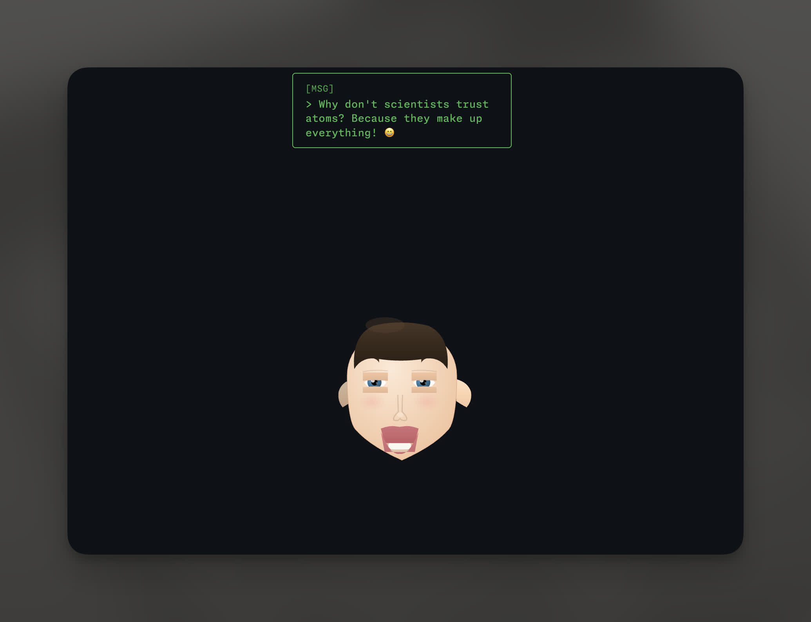
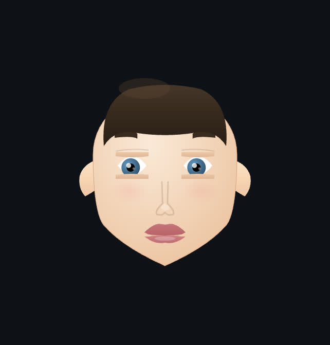
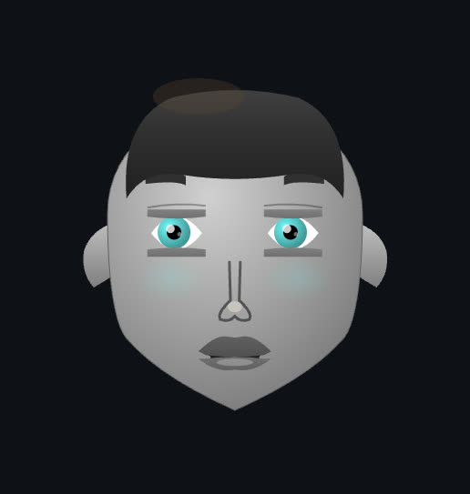
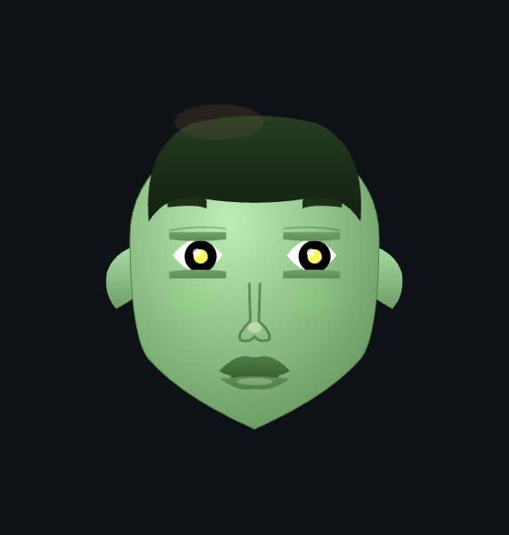
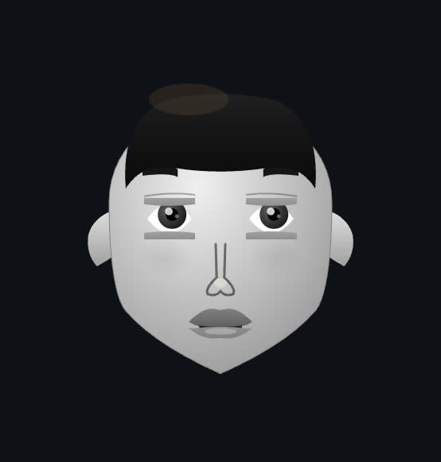

# Ragdoll - Animated Character Controller

A controllable animated character with facial expressions, head poses, and speech bubbles. Control via REST API, WebSocket, or MCP (Model Context Protocol).

## Features

- **Expressive Head**: Stylized SVG head with articulated neck and pivot
- **Facial Moods**: 9 moods with smooth transitions (neutral, smile, frown, laugh, angry, sad, surprise, confusion, thinking)
- **Actions & Speech**: Wink, talk, and live speech bubbles that sync with mouth motion
- **Head Pose Control**: Yaw and pitch with guard rails so the face never leaves view
- **Idle Animations**: Natural blinking, breathing, eye saccades, and subtle head movements
- **Theming**: Multiple built-in themes with customizable colors and gradients
- **Multiple Control Methods**:
  - Interactive Face Control Panel
  - RESTful API
  - WebSocket (real-time)
  - MCP (Model Context Protocol)

## Example



The character demonstrating facial expressions, speech bubbles, and head movements.

## Themes

Ragdoll comes with four built-in themes, each with unique color palettes and visual styles:

   

**Default** (warm, human-like) • **Robot** (metallic, futuristic) • **Alien** (green, otherworldly) • **Monochrome** (classic black and white)

Change themes via the UI control panel, REST API, WebSocket, or MCP tools.

## Quick Start

### 1. Install Dependencies

```bash
npm install
# or
bun install
```

### 2. Run the Application

**Option A: Frontend only (for local development)**

```bash
npm run dev
```

**Option B: Frontend + API server (for full functionality)**

```bash
# Terminal 1: Start the API server
npm run server

# Terminal 2: Start the frontend
npm run dev
```

This starts:

- Web interface at `http://localhost:5173`
- API server at `http://localhost:3001`

### 3. (Optional) Run MCP Server

```bash
npm run mcp-server
```

### 4. (Optional) Docker

```bash
docker compose up
```

## Architecture

### Domain-Driven Design

```
src/packages/
├── character/          # Character domain
│   ├── models/        # Skeleton & geometry
│   ├── controllers/   # Animation controllers
│   ├── components/    # React components
│   ├── themes/        # Theme definitions
│   └── types/         # TypeScript types
├── api/               # API domain
│   ├── server.ts      # Express + WebSocket server
│   └── routes/        # API routes
├── mcp/               # MCP integration
│   └── ragdoll-mcp-server.ts
└── ui/                # UI domain
    ├── components/    # React UI components
    └── hooks/         # Custom React hooks
```

### Character System

The character is built with:

- **RagdollSkeleton**: Lightweight root → headPivot → neck chain
- **RagdollGeometry**: SVG-based cartoon head, hair, and facial features
- **HeadPoseController**: Smooth, clamped yaw/pitch interpolation
- **ExpressionController**: Mood blending plus overlay actions (wink/talk)
- **IdleController**: Natural micro-movements (blink, breathe, saccades)
- **CharacterController**: Coordinates facial state, head pose, and speech bubbles

## Control Methods

### 1. UI Control Panel

The built-in control panel (right side of screen) provides:

- Mood picker (all 9 moods)
- Wink and talk triggers (with clear button)
- Speech bubble editor with tone (default/whisper/shout)
- Head pose sliders for yaw/pitch
- Theme selector
- Live connection status

### 2. REST API

Base URL: `http://localhost:3001/api`

#### Endpoints

- `POST /api/facial-state` – Primary endpoint for moods, actions, head pose, and speech bubbles
- `POST /api/joint` – Direct control of the `headPivot` and `neck` joints (advanced)
- `GET /api/state` – Current serialized character state
- `GET /api/moods` – List of supported moods
- `GET /api/joints` – List of available joints (headPivot, neck)

**Facial State**

```bash
POST /api/facial-state
Content-Type: application/json
{
  "mood": { "value": "laugh", "duration": 0.4 },
  "action": { "type": "wink" },
  "headPose": { "yaw": 0.2, "pitch": -0.05, "duration": 0.5 },
  "bubble": { "text": "hi there!", "tone": "whisper" }
}
```

You can send any subset of the payload (e.g., only `bubble` to update speech).

**Joint Control**

```bash
POST /api/joint
Content-Type: application/json
{
  "joint": "headPivot",
  "angle": { "x": 0, "y": 0.5, "z": 0 }
}
```

**State Query**

```bash
GET /api/state

{
  "headPose": { "yaw": 0.1, "pitch": -0.05 },
  "joints": {
    "headPivot": { "x": 0, "y": 0.1, "z": 0 },
    "neck": { "x": -0.05, "y": 0, "z": 0 }
  },
  "mood": "smile",
  "action": "talk",
  "bubble": { "text": "hello!", "tone": "default" },
  "animation": {
    "action": "talk",
    "actionProgress": 0.48,
    "isTalking": true
  }
}
```

#### Examples

```bash
# Set laugh mood
curl -X POST http://localhost:3001/api/facial-state \
  -H "Content-Type: application/json" \
  -d '{"mood": {"value": "laugh", "duration": 0.4}}'

# Wink
curl -X POST http://localhost:3001/api/facial-state \
  -H "Content-Type: application/json" \
  -d '{"action": {"type": "wink"}}'

# Make the head glance left and up
curl -X POST http://localhost:3001/api/facial-state \
  -H "Content-Type: application/json" \
  -d '{"headPose": {"yaw": -0.3, "pitch": 0.1, "duration": 0.6}}'

# Set a speech bubble
curl -X POST http://localhost:3001/api/facial-state \
  -H "Content-Type: application/json" \
  -d '{"bubble": {"text": "LLMs can talk now!", "tone": "shout"}}'

# Get current state
curl http://localhost:3001/api/state
```

### 3. WebSocket

Connect to: `ws://localhost:3001`

```javascript
import { io } from "socket.io-client";

const socket = io("http://localhost:3001");

// Subscribe to state updates (10 FPS)
socket.emit("subscribe-state");

socket.on("state-update", (state) => {
  console.log("Current state:", state);
});

// Broadcast facial updates in real-time
socket.emit("facial-state", {
  mood: { value: "smile" },
  headPose: { yaw: 0.15 },
});

// Listen for changes triggered by others
socket.on("facial-state-broadcast", (payload) => {
  console.log("Remote payload:", payload);
});

// Unsubscribe when done
socket.emit("unsubscribe-state");
```

### 4. MCP (Model Context Protocol)

The MCP server exposes the ragdoll as MCP tools that can be used by AI assistants.

#### Available Tools

- `setMood` – Transition to a named mood
- `triggerAction` – Wink or start talking
- `clearAction` – Stop the current action
- `setHeadPose` – Adjust yaw/pitch in degrees
- `setSpeechBubble` – Provide or clear bubble text

#### MCP Configuration

Add to your MCP client configuration (e.g., Claude Desktop or Cursor):

```json
{
  "mcpServers": {
    "ragdoll": {
      "command": "bun",
      "args": ["run", "mcp-server"],
      "cwd": "/path/to/ragdoll"
    }
  }
}
```

#### Using MCP Tools

Once configured, you can control the ragdoll through natural language:

```
User: Give them a big laugh
AI: [Uses setMood tool with mood="laugh"]

User: Have them wink and say hi!
AI: [Uses triggerAction tool (wink) then setSpeechBubble tool]

User: Reset back to neutral quietly
AI: [Uses setMood tool (neutral) and clearAction tool]
```

## Available Joints

The head-only rig exposes two joints:

- **headPivot** – Horizontal swivel (yaw)
- **neck** – Vertical nod (pitch)

## Available Moods

- `neutral`
- `smile`
- `frown`
- `laugh`
- `angry`
- `sad`
- `surprise`
- `confusion`
- `thinking`

## Animation System

### Head Pose

- Head pivot (yaw) and neck (pitch) use spring interpolation for a smooth robotic glance.
- Pose changes clamp to ±35° yaw and ±20° pitch so the face never leaves frame.

### Expressions & Actions

- Mood transitions ease between stored facial configurations (mouth scale/offset, eyebrows, eye squish).
- Actions (wink/talk) layer on top of the base mood for additive motion.
- Talking drives procedural mouth squash/stretch synchronized with speech bubbles.

### Idle Animations

- **Blinking**: Natural random blinks with smooth eyelid motion
- **Breathing**: Subtle chest expansion cycle
- **Saccades**: Quick eye micro-movements for lifelike gaze
- **Head Micro-movements**: Organic noise-based subtle head drift

## Development

### Project Structure

Following domain-driven design principles:

- Each package represents a domain (character, api, mcp, ui)
- Clear separation of concerns
- Type-safe interfaces between domains

### Tech Stack

- **React 19** with TypeScript and React Compiler
- **SVG** for 2D character rendering
- **Framer Motion** for animations
- **Express 5** for REST API
- **Socket.io** for WebSocket
- **MCP SDK** for Model Context Protocol
- **Vite 7** for build tooling
- **Bun** for server-side scripts

### Building

```bash
# Development
npm run dev

# Production build
npm run build

# Preview production build
npm run preview

# Type check
npm run type-check

# Lint
npm run lint

# Format
npm run format
```

## API Examples

### Python

```python
import requests

# Laugh, wink, and add a speech bubble
requests.post('http://localhost:3001/api/facial-state', json={
    'mood': {'value': 'laugh', 'duration': 0.4},
    'action': {'type': 'wink'},
    'bubble': {'text': 'Python says hi!', 'tone': 'default'}
})

# Get state
state = requests.get('http://localhost:3001/api/state').json()
print(f"Mood: {state['mood']}")
print(f"Bubble: {state['bubble']}")
```

### JavaScript/Node.js

```javascript
await fetch("http://localhost:3001/api/facial-state", {
  method: "POST",
  headers: { "Content-Type": "application/json" },
  body: JSON.stringify({
    mood: { value: "smile", duration: 0.3 },
    headPose: { yaw: 0.25, duration: 0.4 },
    bubble: { text: "JS was here", tone: "whisper" },
  }),
});

const state = await fetch("http://localhost:3001/api/state").then((r) =>
  r.json(),
);
console.log(state.headPose, state.bubble);
```

## Troubleshooting

### API server not starting

Make sure port 3001 is available:

```bash
lsof -i :3001
```

### Character not visible

1. Check browser console for errors
2. Try refreshing the page

### MCP server not connecting

1. Verify MCP configuration path is correct
2. Check that `npm run mcp-server` works standalone
3. Restart your MCP client

## License

MIT
