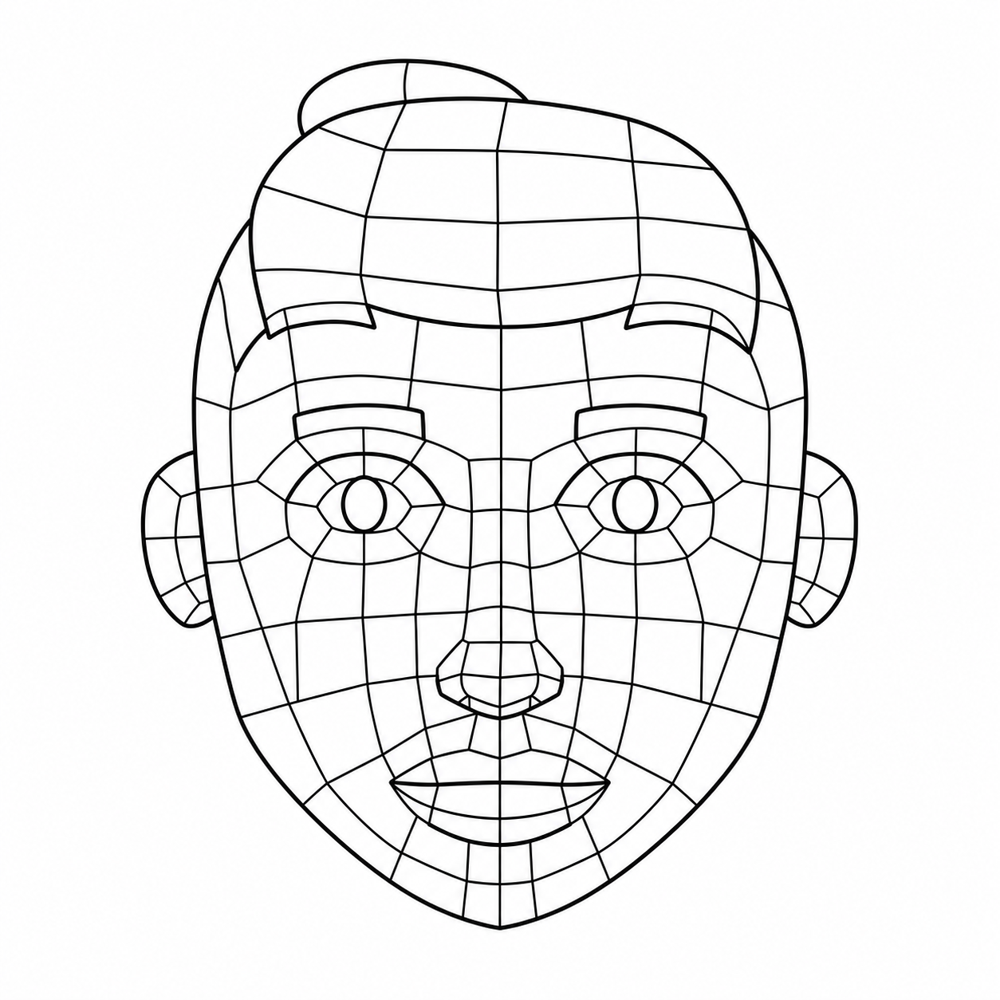

<p align="center">
  
</p>

<h1 align="center">Ragdoll</h1>

Ragdoll is a Bun monorepo for an animated React character, a host-agnostic extension framework, first-party extension packages, an Electron chat app, and the Emote VS Code extension.

## Requirements

- Bun 1.3.14

The repository declares the toolchain through `packageManager` and keeps one root `bun.lock`.

## Setup

```bash
bun install --frozen-lockfile
bun run build
```

Common checks:

```bash
bun run test
bun run typecheck
bun run lint
```

The root build is dependency-ordered: core libraries, extension packages, the example extension, then apps. Every workspace cleans its own generated output before building.

## Workspaces

### Libraries

- `packages/ragdoll` — `@vokality/ragdoll`, the React/SVG character framework.
- `packages/ragdoll-extensions` — React-free extension contracts, registry, host capabilities, loader, serializable slot state, and optional React UI.
- `packages/ragdoll-extension-character` — character control tools.
- `packages/ragdoll-extension-tasks` — task tools, state channel, and slot.
- `packages/ragdoll-extension-pomodoro` — focus timer tools, state channel, and slot.
- `packages/ragdoll-extension-spotify` — Spotify tools through host-provided OAuth.

### Apps

- `apps/chat` — Electron main process plus a React renderer.
- `apps/emote` — VS Code extension, React webview, and Bun-launched MCP helper.

### Example

- `examples/extension-weather` — self-contained extension package showing the canonical package manifest and `createExtension(config)` export.

## Package boundaries

The extension framework has four public entrypoints:

- `@vokality/ragdoll-extensions` — React-free contracts and registry.
- `@vokality/ragdoll-extensions/loader` — discovery through host adapters.
- `@vokality/ragdoll-extensions/slots` — React-free slot state.
- `@vokality/ragdoll-extensions/ui` — React-only rendering helpers.

First-party extensions depend only on the framework contracts. They do not import the chat app, Electron, or one another. Runtime services such as storage, IPC, notifications, config, and OAuth are injected through `ExtensionHostEnvironment`.

The loader receives filesystem and module-import adapters from its host. Package metadata declares both required host capabilities and provided capability types; loading fails transactionally if either contract is false.

## Development

Start the Electron chat app:

```bash
bun run dev:chat
```

Build or package Emote:

```bash
bun run --filter emote build
bun run --filter emote package
```

Run package-specific checks with Bun workspace filters:

```bash
bun run --filter @vokality/ragdoll-extensions test
bun run --filter lumen typecheck
```

## License

MIT
