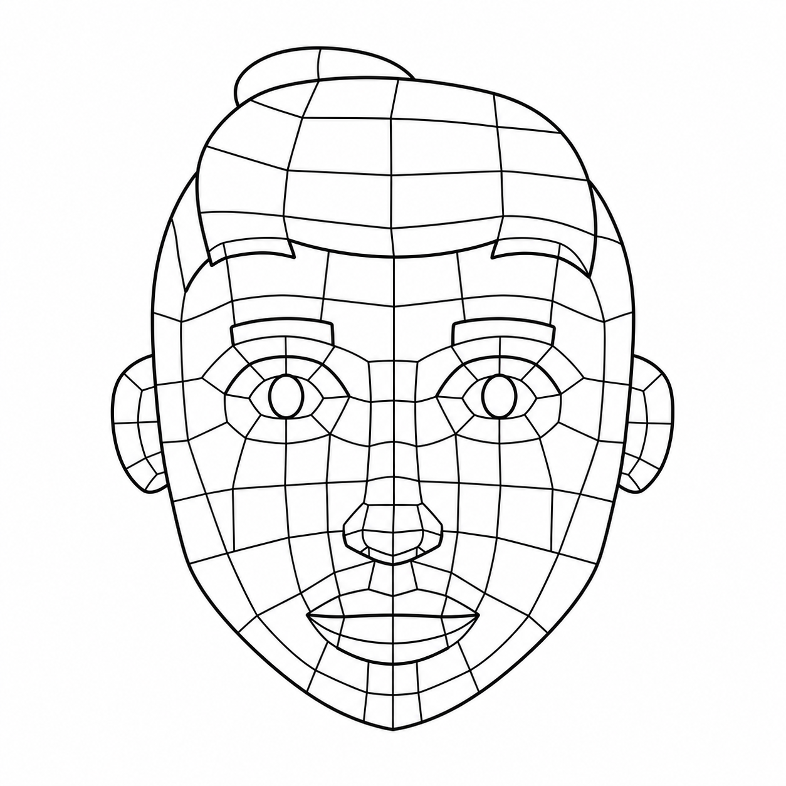
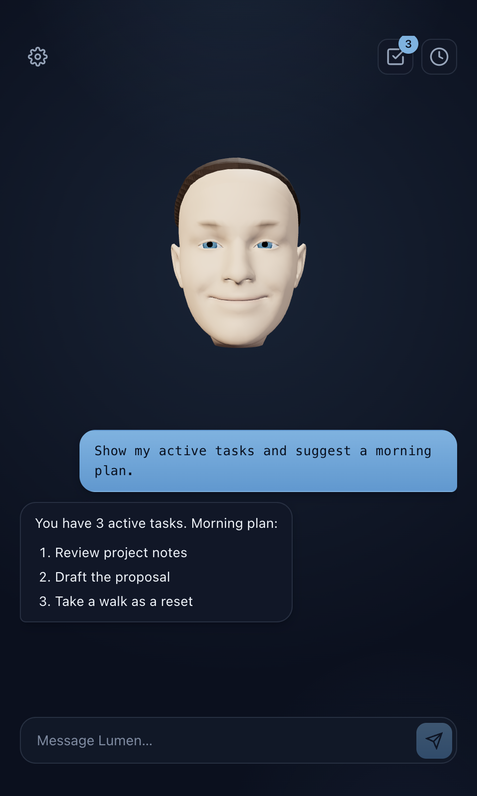
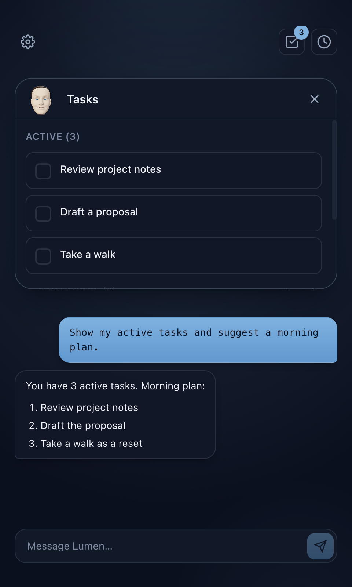

<p align="center">
  
</p>

<h1 align="center">Lumen</h1>

Lumen is a desktop AI assistant with an animated character and tools that act on your requests. Chat with it, manage tasks, save longer notes on a card, start a focus timer, build flash cards, draw on a canvas, or connect services through MCP. Interactive cards open beside the conversation, with the character tucked into the corner so you can keep chatting while you work.

<p align="center">
  
  
</p>

This is the **Ragdoll** monorepo: home to Lumen, the React character and extension frameworks that power it, and first-party extensions.

## Documentation

Lumen’s documentation covers [getting started](docs/site/getting-started.md), [using the app](docs/site/using-lumen.md), [MCP connections](docs/site/mcp/index.md), and [extension development](docs/site/extensions/index.md). Read the published guides at **https://vokality.github.io/ragdoll/**. See [documentation development](docs/README.md) for local preview commands.

## What you can do

- **Chat and act.** The agent can make multiple tool calls, open and close cards, and follow up with a result. Quick requests default to a direct response; longer work can include a brief model-generated acknowledgment.
- **Use interactive tools.** Tasks, notes, a focus timer, flash cards, tic-tac-toe, and a drawing canvas are included. Spotify playback is available after configuring its integration.
- **Connect your services.** Add MCP connections in Settings, sign in with OAuth or supply an access token, then choose which connections the agent may use.
- **Search the web.** Ask for current information or research. Search citations appear as clickable source pills below the answer.
- **Read formatted messages.** User and assistant messages support Markdown, including lists, code blocks, tables, and task lists, while assistant replies stream.
- **Make it personal.** Lumen learns your name through conversation and can remember small preferences in a local profile, separate from chat. Review memory and control occasional check-ins under Settings → About you.
- **Keep context between sessions.** Lumen saves conversations and tool execution history, so the agent can distinguish completed actions from interrupted work. It checks fresh state when needed.
- **Control the character.** Ask it to smile, wink, or change its pose. Choose a character variant and visual theme in Settings.

## Get started from source

You need **Git**, **Bun 1.4.2**, a desktop environment that can run Electron with secure credential storage, and an **OpenAI or xAI API key** with access to the configured model. An internet connection is required for model requests and remote services.

```bash
git clone https://github.com/Vokality/ragdoll.git
cd ragdoll
bun install --frozen-lockfile
bun run dev:chat
```

`dev:chat` uses Bun to build the shared runtime modules and Electron main process before starting the Bun renderer on `http://localhost:5173` and the Lumen desktop window. Use the desktop window: the renderer relies on Electron for credentials, storage, and tools.

On first launch:

1. Choose OpenAI or Grok in the setup screen and enter that provider’s API key. Lumen validates it and stores it encrypted through the operating system's credential storage.
2. Lumen introduces itself in chat and asks what to call you. Tell it what you need, or choose a suggestion to try your first action.
3. Open **Settings** to change the character, manage features and connections, configure integrations, or install extensions.

OpenAI uses **GPT-5.6 Sol** and Grok uses **Grok 4.6**, both with low reasoning. Switch providers through Settings → AI provider. The [provider facade](docs/model-providers.md) keeps chat, extensions, and memory shared across providers. API keys are entered in the app, not a repository `.env` file.

### Try a few requests

- “Show my to-do list and add ‘Plan the weekend.’”
- “Start a 30-minute focus timer.”
- “Create five flash cards for basic Spanish greetings.”
- “Write a weekend itinerary as a note.”
- “Draw a simple house on the canvas.”
- “Search for a recent NASA update and summarize it.”
- “Close the card.”

The agent uses tools to perform actions; opening a card and changing its underlying data are separate operations. You can also interact with the cards directly.

## Add a connection

A **connection** links Lumen to an MCP server or service account. It is independent of installed extensions.

1. Open **Settings → Connections → Add connection**.
2. Enter a connection name and a **Streamable HTTP MCP endpoint**.
3. Choose OAuth, an access token, or no authentication, then save.
4. Select **Connect** or **Sign in / connect**. OAuth sign-in opens your system browser. Some providers require public client settings under the optional provider configuration.
5. Turn on the connection's switch to allow the agent to use its tools.

Saving or connecting does not automatically grant agent access. **Disable** stops access but retains credentials; **Disconnect** also clears local credentials; **Remove** deletes the connection. Enabled connections reconnect in the background on subsequent launches.

Lumen supports HTTPS endpoints and local HTTP servers. Legacy SSE-only endpoints and stdio servers are not supported. See [Connections](docs/connections.md) for authentication details, provider requirements, and the access model.

## Extensions and cards

Extensions add capabilities and, when applicable, an interactive card. Included extensions cover character controls, tasks, the working list, notes, the focus timer, flash cards, tic-tac-toe, canvas drawing, and Spotify tools.

Use **Settings → Extensions → Integrations** to configure Spotify. Use **Settings → Extensions → Extension library** to install additional Ragdoll extensions from a GitHub repository URL. An extension must follow the Ragdoll package contract; an arbitrary GitHub project or MCP server is not an installable extension.

To build an extension, start with [`examples/extension-weather`](examples/extension-weather). The host provides storage, configuration, OAuth, notifications, and other runtime services through typed capabilities.

## Development

Run commands from the repository root. The repository uses one `bun.lock` and pins Bun through `packageManager`.

| Command                                 | Purpose                                                                |
| --------------------------------------- | ---------------------------------------------------------------------- |
| `bun run build`                         | Build libraries, extensions, the example, and apps in dependency order |
| `bun run dev:chat`                      | Rebuild shared packages and Electron, then launch Lumen                |
| `bun run --filter lumen build:electron` | Rebuild main-process and preload code; restart Lumen afterward         |
| `bun run test`                          | Build libraries and run workspace tests                                |
| `bun run test:browser`                  | Run the Electron browser regression suite                              |
| `bun run typecheck`                     | Check architecture boundaries and workspace types                      |
| `bun run lint`                          | Lint the repository                                                    |
| `bun run verify:packages`               | Verify packed libraries and extensions in an isolated consumer         |

Renderer edits reload during development. After main-process, preload, or shared-package edits, stop the development command and restart it; startup rebuilds those packages before launching Electron. More details are in the [Lumen developer README](apps/chat/README.md) and [contributor guide](CONTRIBUTING.md).

### Cursor Cloud

After installation and building, run these in separate terminals instead of `dev:chat`:

```bash
bash .cursor/start-lumen-renderer.sh
```

```bash
bash .cursor/run-lumen-headless.sh
```

The headless launcher supplies the cloud VM's keyring and graphics setup. See the [cloud instructions](AGENTS.md#cursor-cloud-specific-instructions).

## Repository map

| Location                                                     | Role                                                                                  |
| ------------------------------------------------------------ | ------------------------------------------------------------------------------------- |
| [`apps/chat`](apps/chat)                                     | Lumen: Electron desktop app, agent runtime, settings, connections, and extension host |
| [`packages/ragdoll`](packages/ragdoll)                       | React/Three.js animated character framework                                           |
| [`packages/ragdoll-extensions`](packages/ragdoll-extensions) | Extension contracts, registry, host adapters, serializable slot state, and React UI   |
| `packages/ragdoll-extension-*`                               | First-party extensions, including the [canvas](packages/ragdoll-extension-canvas)     |
| [`examples/extension-weather`](examples/extension-weather)   | Canonical extension package example                                                   |

The character framework does not depend on apps or extensions. Shared extensions depend on the extension framework, while apps supply platform services. See [Architecture](ARCHITECTURE.md) for package boundaries and [AGENTS.md](AGENTS.md) for engineering rules.

## Data and credentials

Conversations, settings, tool history, and extension data are stored locally. Model provider API keys and connection credentials are encrypted through Electron's `safeStorage`. Chat context and tool results are sent to the selected model provider to produce responses; enabled remote services receive their tool requests. Lumen is not an offline assistant.

Connection tokens stay in Electron's main process and are used by the MCP client, rather than included in model prompts or chat history. See [conversation events and history](docs/conversation-events.md), [internet access](docs/internet-access.md), and [host OAuth](docs/extension-host-oauth.md) for implementation details.

## License

MIT — see [LICENSE](LICENSE).
