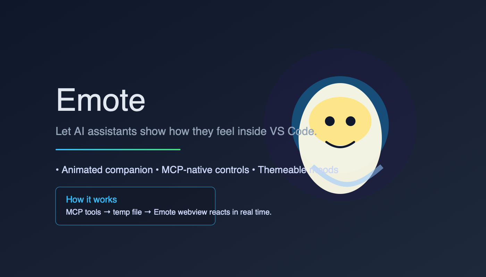
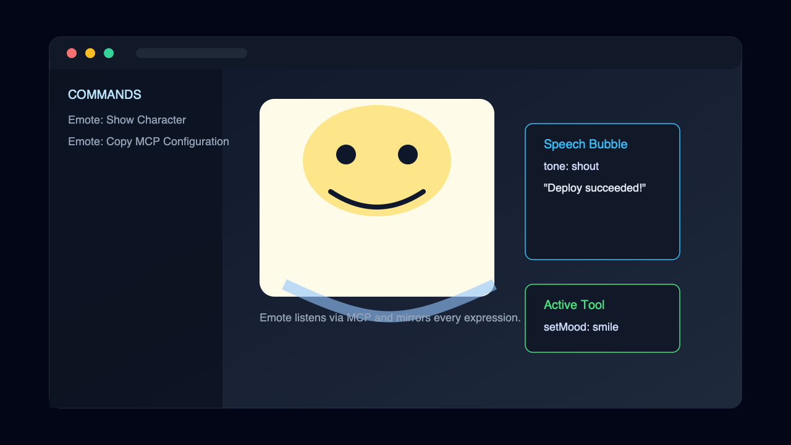
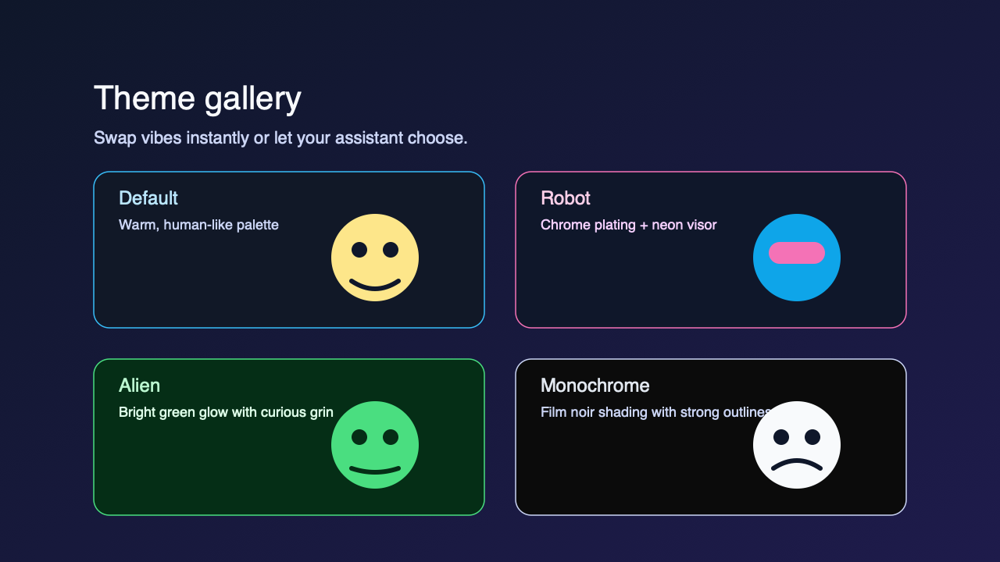

# Emote

Emote lets AI assistants step out of the chat window and into a lively character that lives beside your code. Every expression, wink, and speech bubble is driven over the Model Context Protocol (MCP), so assistants can react in real time without extra servers.

## Highlights

- **Expressive companion** – Smooth facial animation, idle motion, and speech bubbles that feel alive.
- **MCP-native control** – Every expression change is a tool call away. Works with Cursor, Claude, and any MCP-compatible client.
- **Themeable** – Ship-ready looks: Default, Robot, Alien, and Monochrome. Themes sync between VS Code settings and MCP commands.
- **Self-contained** – Builds to a single VSIX. No background daemons, no network sockets, only file-based IPC.

## Installation

### Marketplace (preferred)

1. Open VS Code and launch the Extensions view (`⇧⌘X` / `Ctrl+Shift+X`).
2. Search for **Emote** by `vokality`.
3. Select **Install** and let VS Code restart the extension host if prompted.

### VSIX (offline)

1. Download the latest `emote-*.vsix` from the Releases tab.
2. Run `code --install-extension emote-<version>.vsix`.
3. Reload VS Code.

### From source (contributors)

```bash
cd apps/emote
bun install
bun run verify
bun run build
npx vsce package --no-dependencies
code --install-extension emote-*.vsix
```

> Bun installs workspaces quickly, while production builds still rely on `vsce` for Marketplace compatibility.

## MCP Setup

1. Run the `Emote: Copy MCP Configuration` command inside VS Code to copy a pre-filled block.
2. Paste it into your MCP config (e.g., `~/.cursor/mcp.json`):

```json
{
  "mcpServers": {
    "emote": {
      "command": "node",
      "args": ["/Users/you/.emote/mcp-server.js"]
    }
  }
}
```

3. Restart your MCP client so it begins calling the server.

The extension installs (and auto-updates) `~/.emote/mcp-server.js` every activation, so you always run the version that matches the extension.

## Commands & Tools

### Command Palette

| Command | Purpose |
| --- | --- |
| `Emote: Show Character` | Reveal the companion beside your editor. |
| `Emote: Hide Character` | Close the panel. |
| `Emote: Toggle Character` | Handy single shortcut for show/hide. |
| `Emote: Set Mood` | Force a facial expression such as `smile` or `thinking`. |
| `Emote: Trigger Action` | Play a wink or talk animation. |
| `Emote: Clear Action` | Stop the active action. |
| `Emote: Set Head Pose` | Tilt the head using yaw/pitch degrees. |
| `Emote: Set Speech Bubble` | Show retro terminal text with tones (default/whisper/shout). |
| `Emote: Set Theme` | Swap between Default, Robot, Alien, or Monochrome. |
| `Emote: Copy MCP Configuration` | Copy the JSON block shown above. |

### MCP Tools

| Tool | Input |
| --- | --- |
| `setMood` | `{ "mood": "smile", "duration": 0.5 }` |
| `triggerAction` | `{ "action": "wink", "duration": 1 }` |
| `clearAction` | `{}` |
| `setHeadPose` | `{ "yawDegrees": 15, "pitchDegrees": -5 }` |
| `setSpeechBubble` | `{ "text": "Deployment passed", "tone": "shout" }` |
| `setTheme` | `{ "themeId": "robot" }` |
| `show` / `hide` | `{}` |

## Telemetry & Privacy

- Emote sends **no** telemetry and makes **no** network requests.
- MCP communication happens through a tiny JSON file inside your system temp directory (`/tmp/ragdoll-vscode/command.json`).
- The only files written outside VS Code’s sandbox are `~/.emote/mcp-server.js` (the helper server) and optional screenshots you capture yourself.

## Troubleshooting

| Symptom | Fix |
| --- | --- |
| Panel never appears | Run `Emote: Show Character`, then check the VS Code output channel **Emote** for errors. |
| MCP commands do nothing | Ensure your MCP config points to the latest `~/.emote/mcp-server.js`, then restart the MCP client. |
| Speech bubble text sticks | Use `clearAction` and `setSpeechBubble` with `text: null` to reset. |
| High CPU usage | Reduce polling in the MCP server by leaving the character hidden when not needed (the extension auto-throttles when idle). |

## Screenshots




## License

MIT © Vokality