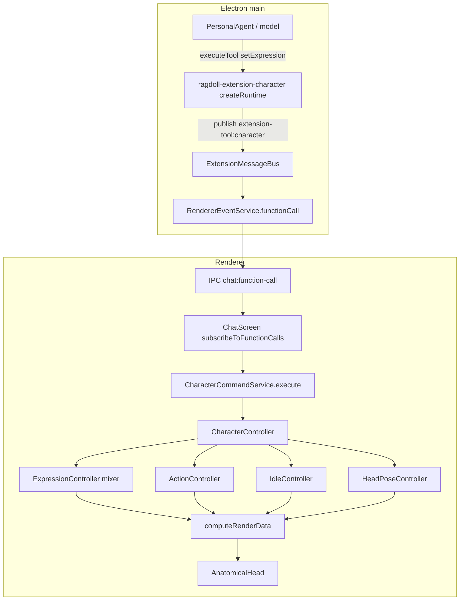
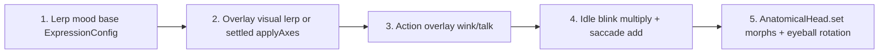
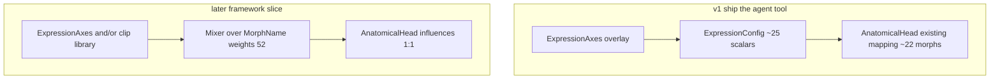

# Character expression mixer and agent `setExpression` tool

| Field | Value |
| --- | --- |
| Author | TBD |
| Date | 2026-09-19 |
| Status | Accepted |
| Repository | `github.com/Vokality/ragdoll` |
| Primary packages | `@vokality/ragdoll`, `@vokality/ragdoll-extension-character`, `lumen` (`apps/chat`) |

## Overview

Lumen’s character is catalog-shaped at the public API (`FacialMood` × `FacialAction` × yaw/pitch) while the runtime is already continuous: `ExpressionController` interpolates an `ExpressionConfig` of ~25 scalars, and `AnatomicalHead` drives a 52-target ARKit-named morph rig, mapping only ~22 of those targets from `ExpressionConfig`. Adding more named moods would not make the framework generic, and the agent cannot currently request a half-smile, a brow raise, a jaw drop, or eye-only gaze.

This spec adds a pose mixer in `@vokality/ragdoll` and one new agent tool, `setExpression`, with a compact set of optional numeric axes. Named moods and timed actions stay as a library of writers into that mixer. The character extension remains a thin IPC facade. v1 maps axes onto the existing `ExpressionConfig` adapter; a later slice mixes `MorphName` weights 1:1. No persisted schema, no feature flag, no `lookAt` sugar.

## Background & Motivation

### Current public surface

`packages/ragdoll/src/types/index.ts` exposes a closed catalog:

- 9 `FacialMood` values: `neutral`, `smile`, `frown`, `laugh`, `angry`, `sad`, `surprise`, `confusion`, `thinking`
- 3 `FacialAction` values besides `none`: `wink`, `talk`, `shake`
- `HeadPose` yaw/pitch in radians, clamped in `HeadPoseController` to ±35° / ±20°

`FacialCommand` is a discriminated union of `setMood`, `triggerAction`, `clearAction`, and `setHeadPose`. There is no channel API.

Lumen’s agent reaches those commands only through `@vokality/ragdoll-extension-character`, which copies `VALID_MOODS` / `VALID_ACTIONS`, validates ranges, and publishes `{ extensionId, tool, args }` on `extension-tool:character`.

### Current runtime (already continuous)

| Layer | What it actually does today |
| --- | --- |
| `RagdollGeometry.getExpressionForMood` | `switch` from mood → full `ExpressionConfig` (SVG/path-era scalars: eye openness, brow Y, `mouth.cornerPull`, `pupilOffset`, …) |
| `ExpressionController` | Lerps `currentExpression` toward that preset; `setMood` no-ops when `mood === currentMood` |
| `ActionController.getExpressionOverlay` | Timed wink (right eye) / talk (mouth opening); shake writes head pose |
| `IdleController` | Blink, saccades, breath, head micro-motion |
| `computeRenderData` | `getExpressionWithAction()` then `applyIdleToExpression` (blink multiply + saccade add) |
| `AnatomicalHead.update` | Fills morph influences from `RenderData.expression`; eyeballs rotate from `pupilOffset * 0.035` |

`CharacterController.update` already runs action → expression → head pose → idle each frame. Composition of face layers is split: mood lerp lives in `ExpressionController`, action merge in `getExpressionWithAction`, idle in `computeRenderData`. There is no axis overlay.

### Pain

- The agent cannot say “half smile, look left, brows up” without inventing a new named mood.
- `setMood` is a full replace of `ExpressionConfig`, including baked `pupilOffset` on `sad` / `thinking` / `confusion`, so intensity and gaze are not independently addressable.
- `AnatomicalHead` already has unused morphs (`jawLeft`/`Right`, `mouthFunnel`, `tongueOut`, `mouthDimple_*`, `eyeLook*`, independent L/R mouth, …). Growing the mood enum does not use them and does not generalize the mixer.
- Grok treats a JSON Schema node that has both `type` and `anyOf` as an empty shape. Canvas drawing still uses a *union* (`anyOf` with `type?: never` on that node; see `packages/ragdoll-extension-canvas/src/tool-schemas.ts` comment “Keep the union untyped” and `ToolValueSchema.anyOf?: never` / `ToolUnionSchema.type?: never` in `packages/ragdoll-extensions/src/types.ts`). Character tools have no unions today. The new tool must be a flat object of optional numbers: no `anyOf` at all, no nested unions.

## Goals & Non-Goals

### Goals

- Treat face pose as a stacked mix per frame: **named mood base → `setExpression` axis overlay → timed action overlay → idle (always additive) → render**. Head pose stays independent.
- Keep `setMood`, `triggerAction`, and `setHeadPose`. Add one unprefixed `setExpression` tool.
- v1 maps the ~6 face/gaze axes onto existing `ExpressionConfig` fields so `AnatomicalHead` and SVG path generators keep working without a morph-level mixer.
- Preserve current `setMood` / `triggerAction` / `setHeadPose` observable behavior except where mix rules require `setMood` to clear leftover face-axis patches (including same-mood calls that currently no-op).
- Wire `setExpression` through the existing fire-and-forget path. `chat-screen.tsx` does not gain a new subscription.
- Duplicate validation ranges in the character extension (main process) to match today’s `VALID_MOODS` pattern. Do not import `@vokality/ragdoll` from the extension.

### Non-goals

- Exposing raw `MorphName` weights or a generic morph dictionary to the model.
- A `lookAt: "card" | "user"` tool (gaze axes first; lookAt is later sugar).
- Moving named moods into an extension, or applying morphs from Electron main.
- Growing `ExpressionConfig` as the long-term public generic API.
- Deleting SVG path generators (`getFacePath`, `getMouthPath`, …) or `applyBlink`.
- Persisting expression overlay across sessions, conversations, or settings.
- Feature flags. Lumen has no flag infrastructure in `AGENTS.md`.
- Changing head-pose units (tools stay degrees; `HeadPoseController` stays radians).
- Driving unused ARKit morphs 1:1 (later framework slice).
- Changing `ExperienceService` / `CharacterCommandService.react` (host `setMood("thinking")` on `"working"` stays; it is a mixer writer under the new rules).
- A v1 API to un-own gaze or restore mood-baked glance after a gaze patch (`clearExpression`, `resetGaze`, or `setMood` dropping gaze). Sticky gaze; `0` = center.

## Key Decisions

1. **Mixer lives in `@vokality/ragdoll`, not in the character extension.** The mesh and `requestAnimationFrame` loop run in the renderer. Extensions run in Electron main and cannot set morphs. Named moods/actions become preset/clip writers into channels, analogous to `registerTheme` / `registerVariant`. Built-in smile/wink stay in the character package so `RagdollCharacter` works without Lumen.

2. **Agents mix both catalog and axes.** Keep the three existing tools. Add one compact `setExpression` patch. Do not expose `MorphName`.

3. **Grok-safe schema.** Flat object, all properties optional numbers with `minimum`/`maximum`. No `anyOf` (not even the canvas-style untyped union). No nested unions, no `type` sibling on a union. Omitted field leaves the channel; explicit `0` is none (for gaze: look-center, not “inherit mood”).

4. **Mix rules: replace-base / replace-owned-axes / overlay-action / independent-skull.** `setMood` replaces the base and **clears the same five face-axis keys on every mood, including `neutral`:** `smile`, `frown`, `brows`, `eyesOpen`, `jaw`. That list is not per-preset ownership; gaze is never in it, even when the preset writes `pupilOffset` (`sad` / `thinking` / `confusion`). `setMood` does not clear `gazeX`/`gazeY` or head pose. `triggerAction` does not change mood or the axis patch. `setHeadPose` is skull only; `gazeX`/`gazeY` are eyes only; both in one turn is valid.

5. **Owned axes replace mapped `ExpressionConfig` fields; they are not deltas on the mood.** Smile mood + `{ smile: 0.3 }` yields `cornerPull ≈ 0.3`, not `0.8` and not `1.0`. Unowned keys inherit the mood base. `smile: 1` and `frown: 1` together cancel to `cornerPull = 0` (`AnatomicalHead` derives `mouthSmile_*` and `mouthFrown_*` from that one scalar). A single bipolar `cornerPull` / `mouth` axis `-1..1` is deferred: keep smile+frown as Grok-friendly 0–1 intensities.

6. **v1 overlay animation is a visual `ExpressionConfig` lerp, not a sparse axis lerp.** Newly owned keys have no well-defined numeric start (`smile: 0` on a smile mood is not “start at 0”). On `setExpression`, snapshot the current mixed face and lerp it toward `applyAxes(moodExpr, overlayTarget)` with the same `easeInOutCubic` as mood. Sparse `overlayTarget` is the settled ownership mask, updated on write, applied as `applyAxes` once `overlayProgress === 1` and on later settled frames.

7. **v1 gaze overlay is sticky.** `setMood` does not drop `gazeX`/`gazeY`. Omit cannot un-own a key. Explicit `gazeX: 0` / `gazeY: 0` is look-center, not “inherit thinking/sad baked `pupilOffset`.” Mood-baked glance is only the never-patched default. `RagdollCharacter` remounts on variant change (`key={props.variant}`), not on conversation switch, so a gaze patch lasts until the next gaze write or a variant remount. No `clearExpression` / `resetGaze` tool in this slice.

8. **v1 is an `ExpressionConfig` adapter; v2 is a `MorphName` mixer.** Do not grow `ExpressionConfig`. Keep adapter constants (gaze pixels, brow Y scale) inside `@vokality/ragdoll`.

9. **Duplicate ranges, do not share a types package.** `@vokality/ragdoll` must not import apps or extensions. First-party extensions must not import `@vokality/ragdoll` (wrong process; React/Three would land in main). Lumen already depends on both and may import `ExpressionAxes` from ragdoll for Zod. The character extension copies field names and numeric ranges the same way it copies `VALID_MOODS`. PR 2 **must** add a `scripts/verify-architecture.ts` source+graph rule that `packages/ragdoll-extension-*` cannot import `@vokality/ragdoll` (today the script only blocks other extensions, Electron, and apps; `package.json` already omits the dependency).

10. **No persistence, no flags.** Expression is live renderer state. Rollout is staged PRs that keep existing tools working.

11. **Last-writer-wins in a turn; order is not reliable.** Host execution is sequential in the model-provided list (`AgentService.appendToolResults` awaits each call because “Tools may depend on earlier mutations”). Responses sessions default `parallel_tool_calls: true`, so Grok may emit `setExpression` before `setMood` in one round. Mixer does not coalesce same-turn calls. Prompt and tool description say “if you also call setMood this turn, call setMood first”; that is guidance, not a guarantee. Tests document both orders.

12. **Host `react("working"|"failed"|"completed")` is a mixer writer.** `ExperienceService.started()` emits `"working"`; `CharacterCommandService.react("working")` always `setMood("thinking", 0.3)` and sets `explicitReaction = false`. That clears the five face-axis keys and keeps gaze. Intensity that should persist across turns must be re-issued (`setMood` then `setExpression`) after thinking. Do not change `ExperienceService` in this spec.

13. **Gaze adapter constants stay the SVG/iris clamps; left/right is confirmed in PR 4.** Ship `GAZE_OFFSET_X = 4` and `GAZE_OFFSET_Y = 5` from thinking’s baked `pupilOffset.x` and `getIrisPosition` clamps. PR 1 bun tests lock adapter arithmetic (`gazeX: 1` → `pupilOffset.x ≈ 4`) and `rotation.y === pupilOffset.x * 0.035`. They do not decide whether +Euler Y is the character’s right. PR 4 (idle off, settled Electron fixture) confirms `gazeX: +1` looks to the character’s right. Flip `GAZE_OFFSET_*` only if the head looks the wrong way. Do not change the tool schema.

14. **`verify-architecture` forbids extension → `@vokality/ragdoll`.** Required in PR 2, not optional. Encodes the process split already stated in decision 9.

## Proposed Design

### Architecture



Only the character extension publishes on `extension-tool:*` today. `LumenApplication` already forwards every such publish to `rendererEvents.functionCall`. `ChatScreen` already routes every function-call name through `CharacterCommandService.execute`. Adding `setExpression` is a new Zod case and a new controller method; it is not a new IPC channel or React subscription.

### Per-frame mix order



Head pose (including shake and idle head micro) is a parallel stack, not a face layer:

```text
HeadPoseController target  →  idle headMicro  →  skeleton joints  →  render yaw/pitch
```

Shake remains an `ActionController` writer into `HeadPoseController`. It does not touch the axis overlay.

**Where each step lives (v1, minimal churn):**

| Step | Owner |
| --- | --- |
| Mood lerp | `ExpressionController` (`currentExpression`; `getExpression()`) |
| Axis overlay (visual lerp while in flight; `applyAxes(mood, overlayTarget)` when settled) | `ExpressionController.getMixedExpression()` |
| Action overlay | `ActionController.getExpressionOverlay` fed the **mixed** expression, merged by `getExpressionWithAction` |
| Idle | `applyIdleToExpression` in `packages/ragdoll/src/components/render-data.ts` (unchanged position: last additive face layer) |
| Morph mapping | `AnatomicalHead.update` (unchanged in v1) |

`ExpressionController.applyBlink` is **not** on the production path. Production blink is `applyIdleToExpression`. Keep `applyBlink` as a test helper or thin wrapper; do not add a third blink compositor.

### Controller state

Public types live once in `packages/ragdoll/src/types/index.ts` next to `FacialMood` (do not also declare them in `expression-axes.ts`). Adapter functions and the cleared-axis list live in `packages/ragdoll/src/models/expression-axes.ts` and import those types. `packages/ragdoll/src/index.ts` exports the types from `./types` and the functions from `./models/expression-axes` (same barrel pattern as `FacialMood` / `RagdollGeometry`).

```ts
type FaceAxis = "smile" | "frown" | "brows" | "eyesOpen" | "jaw";
type GazeAxis = "gazeX" | "gazeY";
type ExpressionAxis = FaceAxis | GazeAxis;

interface ExpressionAxes {
  smile: number;    // 0..1
  frown: number;    // 0..1
  brows: number;    // -1..1  (down … up)
  eyesOpen: number; // 0..1.3 (1 = normal)
  jaw: number;      // 0..1
  gazeX: number;    // -1..1  (character's left … right)
  gazeY: number;    // -1..1  (down … up)
}

type ExpressionPatch = { [K in ExpressionAxis]?: number };

/** Face keys dropped on every setMood, including neutral. Not a per-preset set. */
const FACE_AXES_CLEARED_ON_SET_MOOD: readonly FaceAxis[] = [
  "smile",
  "frown",
  "brows",
  "eyesOpen",
  "jaw",
];

const GAZE_AXES: readonly GazeAxis[] = ["gazeX", "gazeY"];
```

Internal overlay state:

- `overlayTarget: Partial<ExpressionAxes>` — **ownership mask**, updated immediately on write. A present key (including `0`) is owned; a missing key inherits the mood base. Not interpolated.
- `overlayVisualStart: ExpressionConfig` — snapshot of `getMixedExpression()` at the last `setExpression` (deep clone).
- `overlayProgress: number` — `1` = settled; then mixed is `applyAxes(currentExpression, overlayTarget)` every frame.
- `overlayDuration: number` — `0` snaps. In-flight overlay uses `easeInOutCubic` (same helper as mood).

`CharacterState` does **not** gain overlay fields. `getState()` stays mood / action / head pose / joints. Do not add `expressionChanged` to `StateEvent` in v1.

**Getters (do not change `getExpression()` to include overlay):**

| Method | Meaning | Use in tests |
| --- | --- | --- |
| `getExpression()` | Mood lerp only (`currentExpression`). Unchanged. | Existing same-mood / mood-lerp tests |
| `getAxisOverlay()` | `overlayTarget` ownership mask (immediate, not visually interpolated) | Which keys are owned |
| `getMixedExpression()` | `applyAxes` when settled; else `interpolateExpression(overlayVisualStart, applyAxes(currentExpression, overlayTarget), easeInOutCubic(overlayProgress))`. No action, no idle. **Retargets the visual end each frame** so a concurrent mood lerp is not frozen. | Overlay visual effects (`cornerPull`, `pupilOffset`, brows, jaw, openness) |
| `getExpressionWithAction()` | `getMixedExpression()` then action overlay | Wink/talk compose |

`geometry.setExpression(this.currentExpression)` in `update` stays mood-only (existing leftover). Production frames use `computeRenderData` → `getExpressionWithAction()` → idle.

### `setMood` rewrite (behavior-preserving except overlay clear)

Today:

```ts
public setMood(mood: FacialMood, transitionDuration: number = 0.35): void {
  if (mood === this.currentMood) return;
  this.transitionStartExpression = this.currentExpression;
  this.currentMood = mood;
  this.targetExpression = this.geometry.getExpressionForMood(mood);
  this.transitionDuration = Math.max(0.05, transitionDuration);
  this.transitionProgress = 0;
}
```

Required mix rule: every `setMood` drops `FACE_AXES_CLEARED_ON_SET_MOOD` from `overlayTarget`, **including when the named mood is unchanged**, so a leftover smile patch cannot survive “look sad” or a second `setMood("smile")`.

```mermaid
sequenceDiagram
  participant Agent
  participant EC as ExpressionController
  Agent->>EC: setExpression smile 0.9
  Note over EC: overlayTarget.smile = 0.9<br/>visual lerp from current mixed to applyAxes(mood, mask)
  Agent->>EC: setMood sad
  Note over EC: moodStart = mixedNow with mood pupilOffset<br/>drop five face keys; keep gaze<br/>overlayProgress = 1<br/>currentExpression = moodStart<br/>transitionProgress = 0<br/>moodTarget = getExpressionForMood("sad")
  Agent->>EC: getters before update
  Note over EC: getMixedExpression ≈ mixedNow
  Agent->>EC: update frames
  Note over EC: mood lerp carries the face; gaze overlay still applied
```

Algorithm:

1. Let `mixedNow = getMixedExpression()` (honors an in-flight overlay visual lerp).
2. Let `hadFaceOverlay` be true if any `FACE_AXES_CLEARED_ON_SET_MOOD` key is in `overlayTarget`.
3. If `mood === currentMood` and `!hadFaceOverlay` and `overlayProgress >= 1`, keep the existing early return (no visual change; preserves “same mood does not retrigger”).
4. `overlayTarget = pick(overlayTarget, GAZE_AXES)` — drop the five face keys; preserve gaze.
5. `overlayProgress = 1` — mood lerp takes over visual continuity; cancel in-flight overlay visual lerp.
6. `transitionStartExpression` = a **deep clone** of `mixedNow` with both eyes’ `pupilOffset` replaced by `currentExpression`’s offsets (strip baked gaze from the start so the remaining gaze overlay does not double-apply).
7. **Assign the mood-lerp registers in the same call** (today’s `setMood` only writes `transitionStartExpression` and waits for `update()`; that would drop the bake on the next `getMixedExpression()` because `overlayProgress` is already 1):
   - `this.currentExpression = this.transitionStartExpression`
   - `this.transitionProgress = 0`
   - `this.transitionDuration = Math.max(0.05, duration ?? 0.35)` so `setMood(..., 0)` still takes 50 ms (existing extension test allows duration `0`; do not change that clamp)
8. `currentMood = mood`; `targetExpression = geometry.getExpressionForMood(mood)`.

Getters **before the next `update()`** must already satisfy `getMixedExpression() ≈ mixedNow` (`applyAxes(currentExpression, gaze-only overlayTarget)` re-applies gaze on `moodStart`). After `update` past duration: `applyAxes(sadPreset, gazeOverlay)`. Do not rely on production `RagdollCharacter` calling `update()` first to hide a getter pop.

`triggerAction` / `clearAction` / `setHeadPose` are already writers into other layers. They do not clear overlay or mood.

### Host `react` as a mixer writer

`apps/chat/electron/services/experience-service.ts` `started()` sets busy and `reaction("working")`. `CharacterCommandService.react`:

```ts
if (reaction === "working") {
  this.explicitReaction = false;
  controller.setMood("thinking", 0.3);
} else if (reaction === "failed") {
  controller.setMood("sad", 0.3);
} else if (!this.explicitReaction) {
  controller.setMood("smile", 0.4);
  ...
}
```

Under the mix rules those calls are ordinary `setMood`s:

| Host reaction | Mixer effect |
| --- | --- |
| `"working"` (every user turn start) | Mood `thinking`; five face-axis keys cleared; gaze kept; `explicitReaction = false` |
| `"failed"` | Mood `sad`; face-axis keys cleared; gaze kept |
| `"completed"` after `execute` (including `setExpression`) | No auto-smile (`explicitReaction` still true) |
| `"completed"` after `"working"` with no `execute` | Auto `setMood("smile")` because `"working"` cleared `explicitReaction` — existing behavior, now also clears any face overlay that `"working"` did not already drop |

This spec does **not** change `ExperienceService` or skip `setMood("thinking")`. The prompt tells the model to re-apply intensity each turn if it should persist.

`RagdollCharacter` uses `key={props.variant}` (`ragdoll-character.tsx`). Theme changes reuse the controller; conversation clear does not remount. Overlay state (including sticky gaze) survives conversation switches and auto-thinking.

### `setExpression` write path

Do **not** lerp sparse `Partial<ExpressionAxes>`. A missing start key is not `0`; treating it as `0` snaps `cornerPull` (smile mood → `{ smile: 0 }` would start and end at 0) and cannot represent a smile-mood `{ frown: 1 }` transition from `+0.8` to `-1`.

```ts
public setExpression(patch: ExpressionPatch, duration: number = 0.35): void {
  const next: Partial<ExpressionAxes> = { ...this.overlayTarget };
  let wrote = false;
  for (const key of AXIS_KEYS) {
    const value = patch[key];
    if (value === undefined) continue;
    if (!Number.isFinite(value)) {
      throw new Error(`${key} must be a finite number`);
    }
    next[key] = clampAxis(key, value);
    wrote = true;
  }
  if (!wrote) return; // empty object is a no-op success
  this.overlayVisualStart = cloneExpression(this.getMixedExpression());
  this.overlayTarget = next;
  this.overlayDuration = duration;
  this.overlayProgress = duration <= 0 ? 1 : 0;
}

public getMixedExpression(): ExpressionConfig {
  const settled = applyAxes(this.currentExpression, this.overlayTarget);
  if (this.overlayProgress >= 1) return settled;
  return RagdollGeometry.interpolateExpression(
    this.overlayVisualStart,
    settled, // retarget as the mood lerp moves
    this.easeInOutCubic(this.overlayProgress),
  );
}
```

- Omitted field: leave that key as-is in `overlayTarget` (still missing, or still the previous value).
- Explicit `0`: store `0` (channel owned; smile/frown none; gaze = center).
- `duration === 0`: snap. Do **not** reuse the mood minimum of 0.05.
- Omitted duration at the controller: `0.35` (same default as `setMood`).
- Out-of-range finite values: clamp, matching `HeadPoseController.clampYaw`.
- Overlay easing: **`easeInOutCubic`**, the same private helper mood already uses.
- `cloneExpression` / `applyAxes` must deep-clone nested `leftEye` / `rightEye` / `mouth` / brows so later mouth writes cannot mutate `currentExpression`.

`CharacterController.setExpression` forwards to `ExpressionController` and does not emit a new state event.

`FacialCommand` (in `types/index.ts`, importing `ExpressionPatch` from the same file):

```ts
| {
    action: "setExpression";
    params: ExpressionPatch & { duration?: number };
  }
```

`executeCommand` **strips `duration`** so it is not passed as an axis:

```ts
case "setExpression": {
  const { duration, ...patch } = command.params;
  this.setExpression(patch, duration);
  break;
}
```

`FacialStatePayload` is unused in production; leave it alone.

### Frame compose

```ts
public update(deltaTime: number): void {
  // existing mood lerp into this.currentExpression
  if (this.overlayProgress < 1) {
    this.overlayProgress = Math.min(
      1,
      this.overlayProgress + deltaTime / Math.max(this.overlayDuration, 1e-6),
    );
  }
  this.geometry.setExpression(this.currentExpression); // mood-only, unchanged
}

public getExpressionWithAction(): ExpressionConfig {
  const mixed = this.getMixedExpression();
  const action = this.actionController.getExpressionOverlay(mixed);
  return mergeExpressionOverlay(mixed, action);
}
```

`ActionController` wink/talk currently close or open relative to the expression they are given. Passing the **mixed** expression is what makes “half-open eyes + wink” and “jaw patch + talk” compose. Idle still multiplies blink and **adds** saccades in `applyIdleToExpression`, so a held `gazeX` plus idle micro-saccade is “looking that way, alive.”

### v1 axis → `ExpressionConfig` adapter

Keep mapping functions in `packages/ragdoll/src/models/expression-axes.ts`. It is the v1 adapter, not the long-term public generic API.

Constants chosen from current presets and clamps:

| Constant | Value | Evidence |
| --- | --- | --- |
| `GAZE_OFFSET_X` | `4` | `thinking` baked `pupilOffset.x = 4`; `getIrisPosition` horizontal clamp is ~`eyeWidth/2 - irisR - 1` |
| `GAZE_OFFSET_Y` | `5` | `getIrisPosition` clamps `offsetY` to `[-5, 5]` |
| Brow scale | `innerY = brows * 10`, `arcY = brows * 12`, `outerY = brows * 8` | `angry` innerY `-8`, `surprise` innerY `10` / arcY `12` |
| Jaw | `opening = jaw * 26` added above `upperLipBottom + 2` | `AnatomicalHead` `jawOpen = max(0, lowerLipTop - upperLipBottom - 2) / 26` |

`applyAxes(base, overlay)` **deep-clones** `base` (new eye/mouth/brow objects) and, **only for keys present in `overlay`**, **replaces** the mapped fields (not add, not mutate `base`):

**smile / frown → `mouth.cornerPull` (absolute replace)**

- Both present: `cornerPull = clamp(smile - frown, -1, 1)` (so `smile: 1, frown: 1` → `0`; `mouthSmile_*` and `mouthFrown_*` both 0 after `AnatomicalHead` clamp)
- Only `smile`: `cornerPull = smile`
- Only `frown`: `cornerPull = -frown`
- Do not rewrite `width`, lip curves, or `cheekPuff` (mood owns those until a later morph mixer)

**brows → both eyebrows, symmetric**

- `innerY = brows * 10`, `arcY = brows * 12`, `outerY = brows * 8`, `rotation = 0`
- Asymmetric mood brows (`confusion`) remain until `brows` is patched

**eyesOpen → both eyes’ `openness`**

- Direct assign. `confusion`’s L/R difference remains until this key is set
- Do not auto-squint

**jaw → mouth opening used by `jawOpen` (from the cloned base, not incremental)**

```ts
const opening = overlay.jaw * 26;
mouth.lowerLipTop = base.mouth.upperLipBottom + 2 + opening;
mouth.lowerLipBottom = Math.max(
  mouth.lowerLipTop + 2,
  base.mouth.lowerLipBottom + opening,
);
```

Do not keep a running `previousOpening` on the live mood object. `getMouthPath` throws on intersecting lips or lip thickness `< 2`. Unit tests must compose `jaw` `0`, `0.5`, and `1` on `neutral` and `laugh` without throwing, including **in-transition** overlay frames and **talk-during-jaw**.

**gazeX / gazeY → `pupilOffset` on both eyes**

```ts
pupilOffset.x = gazeX * GAZE_OFFSET_X;
pupilOffset.y = -gazeY * GAZE_OFFSET_Y; // spec: +gazeY is up; sad mood uses y:+2 as down
```

Sign of `gazeX` matches existing `pupilOffset.x` (thinking’s `+4`). `AnatomicalHead` already turns eyeballs with `rotation.set(pupilOffset.y * 0.035, pupilOffset.x * 0.035, 0)`. v1 does **not** drive unused `eyeLook*` morphs.

PR 1 bun tests lock **adapter arithmetic and the `* 0.035` Euler mapping**, not character-left vs character-right on the mesh. Assert `gazeX: 1` → `pupilOffset.x ≈ 4` (same as thinking’s bake), `smile: 0.5` → `mouthSmile_L ≈ 0.5`, `jaw: 1` → `jawOpen ≈ 1`, and `rotation.y === pupilOffset.x * 0.035` (and `rotation.x === pupilOffset.y * 0.035`). Same-sign `rotation.y` vs `pupilOffset.x` is implied by that product and is not the left/right gate. Whether positive Euler Y is the character’s right is a visual check in PR 4 (Key Decision 13); if the 3D head looks the wrong way, flip `GAZE_OFFSET_*` only. Do not change the agent schema.

Mood-baked `pupilOffset` (`sad` y:+2, `thinking` x:+4 y:-3, `confusion` opposing offsets) shows through **only while the corresponding gaze key is absent** from `overlayTarget`. After the first gaze patch, those keys stay until a later gaze write or variant remount. `gazeX: 0` is center, not “give thinking’s glance back.”

### Sequencing: v1 adapter vs later 1:1 morph mixer



- **v1** is required to ship `setExpression`. It reuses `ExpressionConfig` because `computeRenderData` and `AnatomicalHead` already speak it.
- **v2** replaces the adapter with a mixer whose channel language is `MorphName` (the mesh’s actual rig). Moods/clips become registered snapshots of those weights. `ExpressionConfig` remains a leftover SVG/path control struct until path generation is deleted; it is not extended with new public fields for every unused morph.
- Agent tools stay high-level in both slices. v2 does not put morph names in the model schema.

Later registry work (not PR 1–4) should copy `registerTheme` / `registerVariant`:

```ts
// packages/ragdoll/src/themes/theme-registry.ts pattern
const moods = new Map<string, MoodPreset>();
export function registerMood(preset: MoodPreset): void {
  moods.set(preset.id, preset);
}
```

v1 keeps `getExpressionForMood`’s `switch`. Do not introduce `registerMood` until a second preset source exists.

### `CharacterController` public methods

```ts
public setExpression(patch: ExpressionPatch, duration?: number): void;
public getAxisOverlay(): Readonly<Partial<ExpressionAxes>>;
public getMixedExpression(): ExpressionConfig;
```

`getExpression()` remains mood-lerp-only. `executeCommand` dispatches `setExpression` after stripping `duration`. Existing `setMood` / `triggerAction` / `setHeadPose` remain.

Export from `packages/ragdoll/src/index.ts`: `ExpressionAxes`, `ExpressionPatch`, axis name unions, plus `applyAxes` / `clampAxis` if hosts/tests need them. Do **not** export `MorphName` (it is not on the public index today; keep it that way).

## API / Interface Changes

### Agent tool `setExpression`

Character extension (`packages/ragdoll-extension-character/src/index.ts`), unprefixed name, same `forward()` helper as the other three tools.

```ts
export interface SetExpressionArgs {
  smile?: number;    // 0..1
  frown?: number;    // 0..1
  brows?: number;    // -1..1
  eyesOpen?: number; // 0..1.3
  jaw?: number;      // 0..1
  gazeX?: number;    // -1..1
  gazeY?: number;    // -1..1
  duration?: number; // 0..5 seconds; 0 snaps
}

export interface CharacterToolHandler {
  setMood(args: SetMoodArgs): Promise<ToolResult> | ToolResult;
  triggerAction(args: TriggerActionArgs): Promise<ToolResult> | ToolResult;
  setHeadPose(args: SetHeadPoseArgs): Promise<ToolResult> | ToolResult;
  setExpression(args: SetExpressionArgs): Promise<ToolResult> | ToolResult;
}
```

JSON Schema (all optional, numbers only):

```ts
{
  type: "object",
  properties: {
    smile: {
      type: "number",
      minimum: 0,
      maximum: 1,
      description: "Smile intensity. Omit to leave unchanged; 0 is none.",
    },
    frown: {
      type: "number",
      minimum: 0,
      maximum: 1,
      description: "Frown intensity. Omit to leave unchanged; 0 is none.",
    },
    brows: {
      type: "number",
      minimum: -1,
      maximum: 1,
      description: "Brow raise. -1 down, 0 rest, 1 up. Omit to leave unchanged.",
    },
    eyesOpen: {
      type: "number",
      minimum: 0,
      maximum: 1.3,
      description: "Eyelid openness. 0 closed, 1 normal, 1.3 wide. Omit to leave unchanged.",
    },
    jaw: {
      type: "number",
      minimum: 0,
      maximum: 1,
      description: "Jaw opening. 0 closed, 1 fully open. Omit to leave unchanged.",
    },
    gazeX: {
      type: "number",
      minimum: -1,
      maximum: 1,
      description:
        "Eye look, character's left to right. 0 is look-center (sticky until the next gaze write). Does not turn the skull or restore a mood-baked glance. Omit to leave unchanged.",
    },
    gazeY: {
      type: "number",
      minimum: -1,
      maximum: 1,
      description:
        "Eye look, down to up. 0 is look-center (sticky). Does not turn the skull. Omit to leave unchanged.",
    },
    duration: {
      type: "number",
      minimum: 0,
      maximum: 5,
      description: "Transition seconds. 0 snaps. Omit for ~0.35s.",
    },
  },
}
```

No `required` array. No `anyOf`. No `additionalProperties` (character tools today omit it). Description of the function:

> Patch facial axes on top of the current mood. Owned axes replace mapped face channels; they are not added to the mood. Omit a field to leave that channel unchanged; pass 0 for none (gaze 0 is look-center, not inherit mood). Does not replace the named mood. Use setMood for named moods. If you also call setMood this turn, call setMood first. gazeX/gazeY move the eyes only and stay until the next gaze write; use setHeadPose to turn the skull. Host auto-thinking at the start of a turn clears smile/frown/brows/eyes/jaw — re-apply intensity this turn if it should persist. Do not pass morph names.

Validation: reuse `optionalNumber` (finite, inclusive min/max). Empty `{}` is valid and forwards; the controller no-ops.

IPC payload (existing envelope; `ExtensionMessageBus` parses `{ tool, args }` and ignores extra keys such as `extensionId`):

```ts
{
  extensionId: "character",
  tool: "setExpression",
  args: { smile: 0.5, gazeX: 0.4, duration: 0.3 },
}
```

### Lumen command service

`apps/chat/src/application/character-command-service.ts`:

```ts
const expressionCommandSchema = z.object({
  smile: z.number().min(0).max(1).optional(),
  frown: z.number().min(0).max(1).optional(),
  brows: z.number().min(-1).max(1).optional(),
  eyesOpen: z.number().min(0).max(1.3).optional(),
  jaw: z.number().min(0).max(1).optional(),
  gazeX: z.number().min(-1).max(1).optional(),
  gazeY: z.number().min(-1).max(1).optional(),
  duration: z.number().min(0).max(5).optional(),
});

type CharacterCommands = Pick<
  CharacterController,
  "setMood" | "triggerAction" | "setHeadPose" | "setExpression"
>;
```

`execute` already sets `explicitReaction = true` before the switch, so `setExpression` already blocks the auto-smile on `completed`. Add:

```ts
case "setExpression": {
  const command = expressionCommandSchema.parse(args);
  const { duration, ...patch } = command;
  controller.setExpression(patch, duration);
  return;
}
```

No degree conversion (axes are unitless). Head pose remains the only degrees → radians call.

### `PRESENTATION_TOOLS`

`apps/chat/electron/services/personal-agent.ts`:

```ts
const PRESENTATION_TOOLS = new Set([
  "setMood",
  "triggerAction",
  "setHeadPose",
  "setExpression",
]);
```

A successful `setExpression` must not call `UserProfileService.recordSuccess` (not the user’s first useful action). Harmless if the tool is not registered yet (PR 3 can land before PR 2).

### System prompt guideline 3

`apps/chat/electron/main-process-config.ts` `SYSTEM_PROMPT`, replace guideline 3 with:

> 3. When a named mood fits, call setMood. Use setExpression to adjust smile or frown intensity, brows, eyesOpen, jaw, or gaze, including on top of a mood. If you also call setMood this turn, call setMood first; the mixer is last-writer-wins and the host may run tools in the model’s listed order. When asked to wink, talk, or shake, call triggerAction; for skull yaw or pitch, call setHeadPose. gazeX/gazeY move the eyes only and stay until the next gaze write (0 is look-center, not a mood glance). Combining setHeadPose with setExpression gaze in one turn is valid. The host sets thinking at the start of a turn and that clears smile/frown/brows/eyes/jaw; re-issue setMood and setExpression this turn if that look should persist. An emoji or written description does not move the face. Do not pass morph names. Use these tools for natural reactions too when appropriate.

## Data Model Changes

**None persisted.** Overlay, mood lerp, and morph influences are renderer memory. Settings, conversation history, and extension storage schemas do not change.

`CharacterState` is unchanged. Optional later: snapshot overlay for undo; not in this slice.

No migration.

## Alternatives Considered

### 1. More named moods instead of axes

Add `halfSmile`, `lookLeft`, `browsUp`, … to `FacialMood`.

- **Pros:** No new tool; Grok already calls `setMood`.
- **Cons:** Combinatorial explosion; cannot compose “sad + look right + slight smile”; does not use the 52-morph rig; does not make the framework generic. **Rejected** (agreed).

### 2. Expose raw `MorphName` weights to the model

One tool `{ morphs: Record<string, number> }`.

- **Pros:** Full rig; no adapter.
- **Cons:** ~52 names the model will misuse; schema either `additionalProperties` or a huge object; Grok-hostile; couples the agent to one mesh. **Rejected** (agreed). Axes stay compact; morph mixer is an internal v2.

### 3. Put moods in the character extension

Extension owns the catalog and sends morph dumps over IPC.

- **Pros:** App-specific expressions without shipping them in `@vokality/ragdoll`.
- **Cons:** Mesh is in the renderer; extensions run in main; `@vokality/ragdoll` cannot import the extension; `RagdollCharacter` would not smile without Lumen. **Rejected** (agreed). Built-ins stay in the character package.

### 4. Shared React-free types package for moods/axes

Extract `FacialMood` + axis ranges so the extension does not duplicate.

- **Pros:** Single source of truth.
- **Cons:** New package or a ragdoll subpath the extension would import, pulling the character framework toward main or splitting `@vokality/ragdoll` against current boundaries. Today’s `VALID_MOODS` copy is the established pattern. **Rejected for this slice** unless a later React-free `@vokality/ragdoll/contract` entrypoint exists for other reasons. Prefer duplicated ranges.

### 5. `lookAt: "card" | "user"` instead of / in addition to gaze axes

- **Pros:** Higher-level, matches UI (card vs camera).
- **Cons:** Needs layout geometry the character package does not own; fails without a card; blocks shipping intensity/gaze. **Deferred** (agreed). Gaze axes first.

### 6. Grow `ExpressionConfig` with first-class `gazeX` / `jaw` fields

- **Pros:** Avoids a parallel `ExpressionAxes` type.
- **Cons:** `ExpressionConfig` is SVG/path leftover (~25 path-era scalars). Making it the generic API freezes the wrong abstraction and still would not address unused morphs. **Rejected** as the long-term API; v1 may *write through* it via `applyAxes`.

### 7. One bipolar mouth axis (`cornerPull` −1..1) instead of smile+frown

- **Pros:** Inverse-mapping a newly owned mouth key is unique; sparse-axis lerp would have a defined start.
- **Cons:** Agent schema wanted two 0–1 intensities (agreed). Visual `ExpressionConfig` lerp solves the newly-owned-key problem without changing the tool. **Deferred.** v1 keeps smile+frown; owned keys still replace the single `cornerPull` scalar.

### 8. Additive patch (`mood.cornerPull + smile - frown`)

- **Pros:** “Patch” as merge.
- **Cons:** Smile mood + `{ smile: 0.3 }` would not yield `0.3`; cannot zero a smile without knowing the preset. **Rejected.** Absolute replace of mapped fields for owned keys.

### 9. `clearExpression` / `resetGaze` / `setMood` also dropping gaze

- **Pros:** Could restore thinking’s baked glance after a gaze patch.
- **Cons:** Extra tool or a behavior change to `setMood` that contradicts “does not clear gaze.” Sticky gaze with `0` = center is the v1 product. **Deferred.**

## Security & Privacy Considerations

| Threat | Severity | Mitigation |
| --- | --- | --- |
| Model passes huge / non-finite numbers into morphs | Medium | Extension `optionalNumber` rejects non-finite and out-of-range **before** IPC; renderer Zod re-validates; controller clamps |
| Model passes morph names or extra keys | Low | Schema is a closed flat object; MorphName is not in the tool; extra keys stripped by Zod |
| Renderer applies unvalidated IPC | Medium | Same two-step validation as `setMood`. `ExtensionMessageBus` requires `{ tool: non-empty string, args: record }` |
| Cross-extension IPC | Low | `assertOwnedTopic` already limits publishes to `extension-tool:<id>` or `<id>:` |
| Persistence of face state | N/A | Overlay is not written to disk; no new PII |

Auth is unchanged (local single-user app, BYOK). `setExpression` is fire-and-forget: tool result `{ success: true, data: { forwarded: true } }` means published, not that a frame has been drawn (same as today’s three tools).

`CharacterCommandService.execute` throws on unknown names. That is existing behavior; only the character extension publishes `extension-tool:*`. Merge PR 3 before PR 2 so that throw is gone before the model can emit the name.

## Observability

No metrics pipeline in Lumen. v1 uses:

- Existing `EventBus` `moodChanged` / `actionTriggered` / `headPoseChanged` (unchanged).
- Tests asserting `getAxisOverlay()` (mask), `getMixedExpression()` (overlay visuals), `getExpressionWithAction()` (wink/talk), `getExpression()` (mood-only), and bun `AnatomicalHead` morph/eyeball mapping.
- Zod / `optionalNumber` errors: extension returns `{ success: false, error }`; renderer throws on parse failure (same as invalid `setMood` args that somehow skip main validation).

Do not log full axis patches in production (noise at 60 fps). If a debug hook is needed later, add it behind `getAxisOverlay()`, not a new IPC channel.

Latency budget: one character, `requestAnimationFrame` already caps `deltaTime` at `0.05`s (`ragdoll-character.tsx`). Extra work is one `ExpressionConfig` lerp (same cost as today’s mood lerp) plus the existing ~22 `influences[i] =` writes. No I/O.

## Rollout Plan

Lumen is a desktop app with no feature-flag module in `AGENTS.md`. Rollout is **staged, independently reviewable PRs** that keep `setMood` / `triggerAction` / `setHeadPose` working on every merge to `main`.

**Merge order: PR 1 → PR 3 → PR 2**, with PR 4 after PR 1 (parallel to 3/2). The renderer accepts `setExpression` before the model can call it. `PRESENTATION_TOOLS` membership is harmless if the tool does not exist yet. PR 3 compile-depends on PR 1 (`Pick<CharacterController, … | "setExpression">`) and does not compile-depend on PR 2.

1. **PR 1 (framework mixer)** — safe alone. Hosts that never call `setExpression` see the same faces except same-mood `setMood` now clears leftover face-axis patches (none exist until `setExpression` is used).
2. **PR 3 (Lumen wiring + prompt)** — Zod case, `PRESENTATION_TOOLS`, guideline 3. Unknown-name throw becomes a no-op path for `setExpression` once this lands.
3. **PR 2 (extension tool)** — registers `setExpression` with the model. Safe on `main` only after PR 3.
4. **PR 4 (browser fixture)** — depends on PR 1; rAF integration, not the primary adapter-sign gate.

Rollback: revert the last PR. No stored overlay to migrate. Users on an older renderer with a newer main (or vice versa) is not a supported split; the app ships main+renderer together.

## Risks

| Risk | Severity | Mitigation |
| --- | --- | --- |
| **Grok schema.** A node with both `type` and `anyOf` is treated as an empty shape (canvas comment; `ToolValueSchema` forbids `anyOf`, `ToolUnionSchema` forbids `type`). | High | Flat optional numbers only. No `anyOf` at all on this tool. No morph map. Extension test: every property `type === "number"`; `anyOf` absent; no `required`. |
| **Sparse-axis lerp pops.** Newly owned keys have no numeric start; smile→`{smile:0}` and smile→`{frown:1}` snap if missing=`0`. | High if unfixed | Visual `ExpressionConfig` lerp from current mixed to `applyAxes(mood, overlayTarget)`. Tests at `t=0.1` of a 0.35s transition. |
| **Blink vs wink.** Idle blink multiplies **both** eyes after the wink overlay (`applyIdleToExpression`). `eyesOpen: 0` makes wink invisible. `eyesOpen: 1.3` still blinks. Wink is right-eye only (`ActionController`). | Medium | Keep idle last and additive. Do not disable blink when `eyesOpen` is patched. Tests: wink on a smile patch still closes the right eye more than the left; blink still reaches `< 0.4` openness over a few seconds (`render-data.test.ts` already covers idle blink). |
| **Leftover SVG `ExpressionConfig`.** `computeRenderData` still builds `facePath` / `mouthPaths` / crease paths for a Three.js renderer that reads scalars + morphs. Path generators throw on invalid lip geometry. | Medium | `applyAxes` clones and keeps `getMouthPath` invariants (settled, in-transition, talk+jaw). Do not add fields to `ExpressionConfig`. v2 morph mixer is the exit. |
| **Duplicated validation.** Extension `optionalNumber`, renderer Zod, controller `clampAxis` can drift (already true for `VALID_MOODS` vs `moodCommandSchema` vs `FacialMood`). | Medium | Copy the range table into the three sites in the same PR that introduces the field. Extension test rejects `NaN` / `Infinity` / `1.31` eyesOpen / `gazeX: 1.1`. Command-service test rejects the same. Controller test clamps `smile: 2` → `1`. |
| **Same-mood `setMood` early return.** Current code skips overlay clear. After a smile patch, `setMood("smile")` would leave the patch. | High if unfixed | Rewrite as specified. Test: patch `smile: 0.2` on smile mood, `setMood("smile")`, settled `getMixedExpression().mouth.cornerPull` matches `getExpressionForMood("smile")` (~0.8), overlay face keys empty. |
| **Tool order.** `setMood` after `setExpression` in one turn wipes face patches. `parallel_tool_calls: true` means Grok may list expression first. | Medium | Last-writer-wins; do not coalesce. Tool description + prompt say mood first; tests document both orders. Do not claim the prompt makes order reliable. |
| **Host auto-thinking.** Every turn `react("working")` → `setMood("thinking")` clears face overlays. | Medium | Document as a mixer writer. Prompt: re-apply intensity each turn. PR 3 tests. Do not change `ExperienceService`. |
| **Sticky gaze.** First `gazeX` patch hides sad/thinking baked glance for the controller lifetime (variant remount). | Medium (accepted) | Key Decision 7. `0` = center. Test: `{ gazeX: 0.8 }` then `{ gazeY: 0 }` then `setMood("thinking")` does not restore `x: 4`. |
| **Mood-baked gaze vs overlay.** Mood lerp includes `pupilOffset`. If `moodStart` bakes gaze and overlay also applies gaze, eyes double-deflect during the transition. | High if unfixed | Mood start uses mixedNow with mood `pupilOffset`; gaze keys stay overlay-only. |
| **Talk + jaw.** Talk rewrites `mouth` from the mixed expression (`action-controller.ts`). After v1 that is the jaw-patched mouth. `getMouthPath` can throw. | Medium | Additive talk accepted (same as talk on `laugh` today). Tests: `jaw: 1` on laugh + talk through `getMouthPath` / `computeRenderData`; `getExpression()` mood objects unchanged. |
| **Mutating `currentExpression`.** `applyAxes` that writes `mouth` in place permanently corrupts the mood lerp. | High if unfixed | Deep clone; assert `getExpression()` identity/values unchanged after `setExpression`. |
| **PR 2 without PR 3.** Model can call `setExpression`; renderer throws. | Medium | Merge order PR 1 → PR 3 → PR 2. |

### Range duplication (canonical numbers)

| Field | Min | Max | Extension | Zod | Controller |
| --- | --- | --- | --- | --- | --- |
| smile | 0 | 1 | `optionalNumber` | `z.number()` | `clampAxis` |
| frown | 0 | 1 | same | same | same |
| brows | −1 | 1 | same | same | same |
| eyesOpen | 0 | 1.3 | same | same | same |
| jaw | 0 | 1 | same | same | same |
| gazeX | −1 | 1 | same | same | same |
| gazeY | −1 | 1 | same | same | same |
| duration | 0 | 5 | same | same | `duration <= 0` snaps; else as given |

Lumen may import `ExpressionPatch` from `@vokality/ragdoll`. The extension copies the table; it does not import ragdoll.

## Test Plan

Unless noted, overlay **visual** asserts use `getMixedExpression()` (or `getExpressionWithAction()` with action `none`). Ownership asserts use `getAxisOverlay()`. Mood-lerp asserts use `getExpression()`. Do not assert overlay effects on `getExpression()`.

### Unit — `@vokality/ragdoll` (`packages/ragdoll/tests/controllers/` and `tests/models/`)

New `expression-mixer.test.ts` (or extend `expression-controller.test.ts` + `character-controller.test.ts`):

| Case | Setup | Assert |
| --- | --- | --- |
| Mood then patch | `setMood("smile")`; settle; `setExpression({ smile: 0.3 })`; settle | `getCurrentMood() === "smile"`; `getMixedExpression().mouth.cornerPull ≈ 0.3` (not 0.8); `getExpression().mouth.cornerPull ≈ 0.8`; overlay has `smile: 0.3` |
| Patch then mood | `setExpression({ smile: 0.9 })`; `setMood("sad")`; settle | mood `sad`; overlay has no `smile`; mixed `cornerPull ≈` sad preset `−0.6`; leftover 0.9 gone |
| `setMood` bake before `update()` | smile patch settled; `setMood("sad")`; **no** `update()` | mixed `cornerPull` still ≈ patched smile; overlay face keys empty; `getExpression()` is the bake clone (mood `pupilOffset`); after `update` past duration → sad `cornerPull` |
| Host thinking via mixer | `setExpression({ smile: 0.3, gazeX: 0.8 })`; `setMood("thinking")`; settle | overlay face keys empty; `gazeX` still 0.8; mood `thinking` |
| Reverse execute order | `executeCommand` setExpression then setMood vs setMood then setExpression | Documents last-writer-wins; expression-then-mood drops the face patch |
| Same-mood clears face patch | `setMood("smile")`; `setExpression({ smile: 0.2 })`; `setMood("smile")`; settle | mixed `cornerPull ≈ 0.8`; overlay face keys empty |
| Same-mood no-op when clean | `setMood("smile")`; capture `getExpression()`; `setMood("smile")` | `getExpression()` equal (existing test still holds) |
| Wink on top | smile + `{ smile: 0.5 }` + `triggerAction("wink")` | `getExpressionWithAction().rightEye.openness < leftEye`; mixed `cornerPull ≈ 0.5`; mood still `smile`; overlay unchanged |
| Gaze preserved across `setMood` | `{ gazeX: 0.8, gazeY: 0.4 }` then `setMood("sad")` | overlay still `{ gazeX: 0.8, gazeY: 0.4 }`; mixed `pupilOffset.x > 0`; not overwritten by sad’s `{ x: 0, y: 2 }` |
| Sticky gaze vs thinking bake | `{ gazeX: 0.8 }` then `{ gazeY: 0 }` then `setMood("thinking")` | overlay still owns `gazeX` (and `gazeY: 0`); mixed `pupilOffset.x ≈ 3.2`, **not** thinking’s `4` |
| Omitted field leave | `{ smile: 0.5 }` then `{ brows: 1 }` | overlay `{ smile: 0.5, brows: 1 }` |
| Explicit 0 | `{ smile: 0 }` on smile mood; settle | mixed `cornerPull ≈ 0` (none), not the preset 0.8 |
| Smile → `{ smile: 0 }` in transition | smile mood settled; `{ smile: 0, duration: 0.35 }`; `update(0.1)` | mixed `cornerPull` **decreases from ~0.8 toward 0**; not already 0 |
| Smile → `{ frown: 1 }` in transition | smile mood; `{ frown: 1, duration: 0.35 }`; `update(0.1)` | mixed `cornerPull` decreases **monotonically** from ~0.8; no single-frame snap to 0 |
| Thinking → `{ gazeX: 0 }` in transition | thinking settled; `{ gazeX: 0, duration: 0.35 }`; `update(0.1)` | mixed `pupilOffset.x` eases from `4` toward `0` |
| Empty patch | `setExpression({})` | overlay unchanged; no throw |
| Duration 0 | `{ smile: 1, duration: 0 }` | after `update(0)`, mixed `cornerPull ≈ 1` |
| Clamp | `{ smile: 2, brows: -4 }` | overlay `{ smile: 1, brows: -1 }` |
| Non-finite | `{ smile: NaN }` | throw |
| `applyAxes` does not mutate mood | capture `getExpression()`; `setExpression({ jaw: 1, smile: 0.5 })` | `getExpression()` deep-equal to capture |
| Jaw geometry settled | `{ jaw: 1 }` on neutral and laugh | `getMouthPath` does not throw; `jawOpen` formula `> 0.9` |
| Jaw geometry in transition | `{ jaw: 1, duration: 0.35 }` on laugh; sample `t=0.1` mixed mouth | `getMouthPath` does not throw |
| Talk + jaw | laugh + `{ jaw: 1 }` + `triggerAction("talk")` | `getMouthPath` / `computeRenderData` do not throw |
| Head pose independent | `setHeadPose({ yaw: 0.3 })` + `{ gazeX: 1 }` | pose yaw still moving; gaze on pupils |
| `executeCommand` strips duration | `{ action: "setExpression", params: { smile: 0.5, duration: 0.2 } }` | overlay smile 0.5; duration is not an axis key |

Keep existing mood-lerp, wink, talk, shake, and idle-blink tests green. Update the same-mood test only if it would hide overlay-clear (split “no retrigger when clean” vs “clears face overlay”).

**PR 1 bun mesh mapping** (`packages/ragdoll/tests/renderers/anatomical-head.test.ts`): construct `AnatomicalHead` + `computeRenderData` with **idle disabled**. After settled `{ smile: 0.5, gazeX: 1, jaw: 1 }`, require adapter outputs `pupilOffset.x ≈ 4` (same as thinking’s bake), `mouthSmile_L ≈ 0.5`, `jawOpen ≈ 1`, and `rotation.y === pupilOffset.x * 0.035` (and `rotation.x === pupilOffset.y * 0.035`). These lock the adapter and the existing Euler product. They do **not** decide whether +Y is the character’s right (PR 4 visual gate, Key Decision 13).

### Unit — character extension (`packages/ragdoll-extension-character/src/index.test.ts`)

Mirror the `setMood` forwarder test:

- `executeTool("setExpression", { smile: 0.5, gazeX: -0.2, duration: 0.4 })` publishes `{ topic: "extension-tool:character", payload: { extensionId: "character", tool: "setExpression", args: { smile: 0.5, gazeX: -0.2, duration: 0.4 } } }` and `{ success: true, data: { forwarded: true } }`.
- Reject `NaN` / `Infinity` / `"-1"` / `null` on every numeric field **before** publish (`published` stays `[]`).
- Reject `smile: 1.1`, `eyesOpen: 1.31`, `brows: -1.01`, `duration: 5.01`.
- Accept `{}`, `{ smile: 0 }`, `{ eyesOpen: 1.3 }`, `{ duration: 0 }`.
- Tool definition: every property `type === "number"`; no `anyOf`; no `required`.

### Unit — `CharacterCommandService` (PR 3)

Keep the existing `Pick` mock (`setMood` / `triggerAction` / `setHeadPose` recorders). Overlay clearing lives in `ExpressionController.setMood` and is covered in PR 1 (`Host thinking via mixer`). Do not assert `getAxisOverlay()` on the mock.

- `execute(..., "setExpression", { smile: 0.5, gazeY: -1 })` calls `controller.setExpression({ smile: 0.5, gazeY: -1 }, undefined)`.
- Invalid args throw (Zod).
- `react("completed")` after `setExpression` does **not** force `smile` (explicit reaction already true).
- `react("working")` calls `setMood("thinking", 0.3)` (and sets `explicitReaction = false`).
- `react("working")` then `react("completed")` without `execute` still auto-smiles (`explicitReaction` was cleared).

### Unit — `PersonalAgent`

Extend `personal-agent.test.ts`: a successful `setExpression` (and the existing three presentation tools) does **not** set `experience.firstSuccess`. A following `addTask` still does.

### Browser fixture — rAF integration (PR 4)

Add `packages/ragdoll/tests/renderers/expression-mix.html` + `.js`, register in `apps/chat/tests/browser-pages.ts` next to `lifecycle.html`.

This is **rAF / Electron integration** plus the visual left/right check (Key Decision 13). PR 1 bun tests lock adapter scalars and `rotation = pupilOffset * 0.035`; they cannot tell whether +Y Euler is the character’s right. Do not screenshot-diff.

- Mount `RagdollCharacter` (real canvas + rAF), `onControllerReady`.
- **Wait until settled**, not a fixed two frames: poll until mood lerp and overlay progress are done (elapsed ≥ duration, or `getAxisOverlay()` + mixed values stable), accounting for `setMood`’s `Math.max(0.05, duration)` floor.
- `setIdleEnabled(false)` for **any** gaze sample that goes through `computeRenderData` (idle saccades max offset 3 can flip a `gazeX: 0.6` → `2.4` sign).
- Sequence: settle `setMood("neutral")`; `setExpression({ smile: 0.5, gazeX: 0.6, gazeY: 0.2 }, 0)`; wait settled; `getMixedExpression().mouth.cornerPull ≈ 0.5` and `pupilOffset.x > 0`.
- Visual left/right gate (Key Decision 13): with idle off, `gazeX: +1` must look to the **character’s right** on the anatomical head (schema: left … right). If it looks left, flip `GAZE_OFFSET_X` (and `GAZE_OFFSET_Y` if up/down is inverted). Do not treat `rotation.y` same-sign-as-`pupilOffset.x` as this gate. Do not change the tool schema.
- `triggerAction("wink")`; right eye more closed than left.
- `setMood("sad")`; wait settled; gaze `pupilOffset.x` still positive; mixed `cornerPull` negative (sad), not 0.5.

## Open Questions

None. Gaze adapter constants and the extension ↛ `@vokality/ragdoll` linter are Key Decisions 13 and 14.

## References

- `packages/ragdoll/src/types/index.ts` — `FacialMood`, `FacialAction`, `FacialCommand`, `HeadPose`
- `packages/ragdoll/src/models/ragdoll-geometry.ts` — `ExpressionConfig`, `getExpressionForMood`, `interpolateExpression`
- `packages/ragdoll/src/controllers/expression-controller.ts` — mood lerp, `getExpressionWithAction`, `applyBlink`, `easeInOutCubic`
- `packages/ragdoll/src/controllers/action-controller.ts` — wink / talk overlay, shake → head pose
- `packages/ragdoll/src/controllers/idle-controller.ts` — blink, saccade (`saccadeMaxOffset = 3`), head micro
- `packages/ragdoll/src/controllers/character-controller.ts` — `executeCommand`, public writers
- `packages/ragdoll/src/controllers/head-pose-controller.ts` — ±35° / ±20°, critically damped spring
- `packages/ragdoll/src/components/render-data.ts` — `applyIdleToExpression`, `computeRenderData`
- `packages/ragdoll/src/components/ragdoll-character.tsx` — `key={props.variant}` remount
- `packages/ragdoll/src/renderers/three/anatomical-head.ts` — `MorphName` (52), `set()` mapping (~22), eyeball `rotation.set(pupilOffset.y * 0.035, pupilOffset.x * 0.035, 0)`
- `packages/ragdoll/src/themes/theme-registry.ts`, `packages/ragdoll/src/variants/variant-registry.ts` — `registerTheme` / `registerVariant` pattern
- `packages/ragdoll-extension-character/src/index.ts` — tools, `VALID_MOODS`, `forward()`
- `apps/chat/src/application/character-command-service.ts` — Zod + `execute` + `react`
- `apps/chat/electron/services/experience-service.ts` — `started()` → `"working"`
- `apps/chat/electron/services/agent-service.ts` — sequential `appendToolResults`
- `apps/chat/electron/services/responses-session.test.ts` — `parallel_tool_calls: true`
- `apps/chat/electron/services/extension-message-bus.ts` — `extension-tool:<id>`
- `apps/chat/electron/services/personal-agent.ts` — `PRESENTATION_TOOLS`
- `apps/chat/electron/main-process-config.ts` — `SYSTEM_PROMPT` guideline 3
- `apps/chat/src/screens/chat-screen.tsx` — `subscribeToFunctionCalls` → `execute`
- `packages/ragdoll-extensions/src/types.ts` — `ToolValueSchema.anyOf?: never` / `ToolUnionSchema.type?: never`
- `packages/ragdoll-extension-canvas/src/tool-schemas.ts` — “Keep the union untyped: Grok treats an object sibling as an empty shape.”
- `ARCHITECTURE.md`, `AGENTS.md`, `scripts/verify-architecture.ts`

## PR Plan

### PR 1 — Character mixer and `setExpression` on `CharacterController`

- **Title:** Add expression axis mixer and `setExpression` to the character framework
- **Files / components:**
  - `packages/ragdoll/src/types/index.ts` — `ExpressionAxes`, `ExpressionPatch`, axis unions, `FacialCommand` variant (types only)
  - `packages/ragdoll/src/models/expression-axes.ts` (new) — ranges, `FACE_AXES_CLEARED_ON_SET_MOOD`, `clampAxis`, `applyAxes`, `cloneExpression`
  - `packages/ragdoll/src/index.ts` — export types from `./types`, functions from `expression-axes`
  - `packages/ragdoll/src/controllers/expression-controller.ts` — overlay mask + visual lerp, `setExpression`, `setMood` face-key clear, `getMixedExpression`
  - `packages/ragdoll/src/controllers/character-controller.ts` — `setExpression`, getters, `executeCommand` strips `duration`
  - `packages/ragdoll/tests/controllers/expression-controller.test.ts`
  - `packages/ragdoll/tests/controllers/character-controller.test.ts`
  - `packages/ragdoll/tests/controllers/expression-mixer.test.ts` (new; mix table including in-transition `cornerPull` / gaze)
  - `packages/ragdoll/tests/models/expression-axes.test.ts` (new; clone/non-mutation, jaw lip invariants settled + in-transition, clamp)
  - `packages/ragdoll/tests/renderers/anatomical-head.test.ts` — idle off; `gazeX: 1` → `pupilOffset.x ≈ 4`; `mouthSmile_*` vs `smile: 0.5`; `jawOpen` vs `jaw: 1`; `rotation.y === pupilOffset.x * 0.035` (not the PR 4 left/right gate)
- **Depends on:** none
- **Changes:** Rewrite `setMood` / existing writers as inputs to the mixer without changing catalog APIs. `setMood` assigns `currentExpression = moodStart` and `transitionProgress = 0` in the same call. Visual `ExpressionConfig` overlay lerp. v1 `applyAxes` onto `ExpressionConfig` (absolute replace, deep clone). Unit tests for mood→patch, patch→mood, bake-before-`update()`, `setMood("thinking")` after a smile+gaze patch, both execute orders, same-mood clear, wink-on-top, sticky gaze, in-transition monotonic `cornerPull`, duration 0, empty patch, talk+jaw, non-mutation. Idle remains in `computeRenderData`. No extension or Lumen changes. Independently mergeable.

### PR 3 — Lumen command service, presentation set, and prompt

- **Title:** Route `setExpression` through Lumen and teach the agent to mix mood with axes
- **Files / components:**
  - `apps/chat/src/application/character-command-service.ts` — Zod case, `CharacterCommands` pick
  - `apps/chat/src/application/character-command-service.test.ts` — execute; `react("working")` calls `setMood("thinking")`; working then completed without execute auto-smiles (Pick mock; overlay asserts stay in PR 1)
  - `apps/chat/electron/services/personal-agent.ts` — `PRESENTATION_TOOLS`
  - `apps/chat/electron/services/personal-agent.test.ts` — `setExpression` is not `firstSuccess`
  - `apps/chat/electron/main-process-config.ts` — guideline 3 (mood first as guidance; re-apply intensity each turn; sticky gaze)
- **Depends on:** PR 1 (`CharacterController.setExpression`). Does **not** depend on PR 2. `chat-screen.tsx` unchanged.
- **Changes:** Renderer Zod → `controller.setExpression`. Presentation tools exclude `setExpression` from first useful action. Prompt: named mood when it fits; `setExpression` for intensity/gaze/brows/jaw including on top of a mood; emoji/text still does not move the face; no morph names; if also `setMood` this turn, call it first (not a guarantee); host thinking clears face axes.

### PR 2 — Character extension `setExpression` tool

- **Title:** Add Grok-safe `setExpression` character tool
- **Files / components:**
  - `packages/ragdoll-extension-character/src/index.ts` — `SetExpressionArgs`, parser, schema, `CharacterToolHandler`, `forward("setExpression", …)`
  - `packages/ragdoll-extension-character/src/index.test.ts` — forwarder, range rejection, schema shape (`type: number`, no `anyOf`)
  - `scripts/verify-architecture.ts` — **required:** forbid `packages/ragdoll-extension-*` from importing `@vokality/ragdoll` (source imports and `package.json` graphs; Key Decision 14)
- **Depends on:** PR 3 must already be on `main` (renderer accepts the name). No compile dependency on PR 1.
- **Changes:** Main-process validation and IPC envelope only. Does not import `@vokality/ragdoll`. Copy axis ranges from the table in this spec. Tool description includes “If you also call setMood this turn, call setMood first” and host auto-thinking. Architecture linter encodes the extension ↛ ragdoll process split.

### PR 4 — Browser fixture for expression mix (rAF)

- **Title:** Add Electron browser fixture for expression mix
- **Files / components:**
  - `packages/ragdoll/tests/renderers/expression-mix.html`
  - `packages/ragdoll/tests/renderers/expression-mix.js`
  - `apps/chat/tests/browser-pages.ts` — register the page
- **Depends on:** PR 1
- **Changes:** Real `RagdollCharacter` canvas + rAF. Wait until settled (not two frames). Idle off for gaze samples. Assert half smile, wink overlay, and `setMood("sad")` preserving gaze while replacing the smile patch. Visual left/right gate (Key Decision 13): confirm `gazeX: +1` looks to the character’s right; flip `GAZE_OFFSET_*` only if inverted; do not change the tool schema. Adapter scalars and `* 0.035` live in PR 1 bun tests.

**Merge order:** PR 1 → PR 3 → PR 2, with PR 4 after PR 1 (parallel to 3/2).
